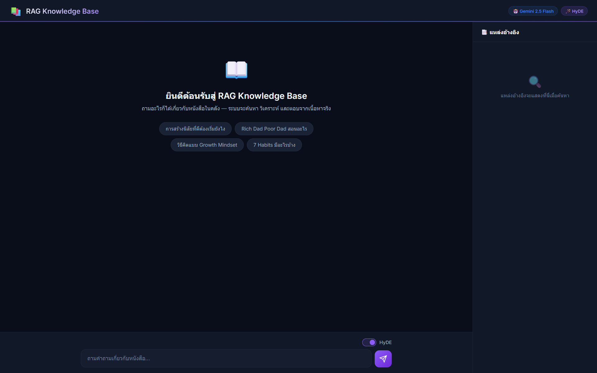
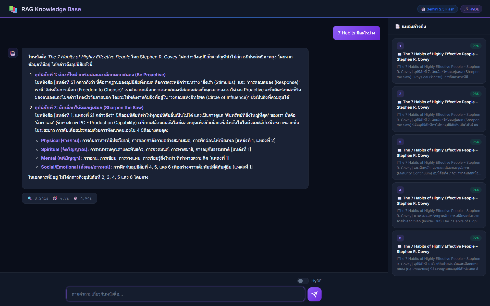
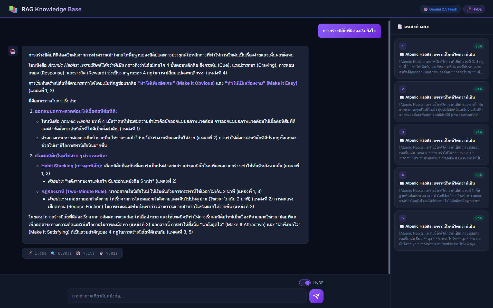

# 📚 RAG System — Full Pipeline Knowledge Base

ระบบค้นหาและตอบคำถามจากหนังสืออัจฉริยะ ผสม **HyDE Query Transform** + **Hybrid Search** + **Adaptive Reranking** + **Gemini LLM Generation** พร้อม **Web UI** แบบ real-time streaming

> **สถานะ:** ✅ Full RAG Pipeline สมบูรณ์ (v2.0)  
> **Version:** 2.0 — HyDE + Hybrid Search + Adaptive Reranking + Gemini Generation + Web UI

📘 **[เอกสารเทคนิคฉบับเต็ม (Technical Guide)](docs/technical_guide.md)**

---

## 📸 Screenshots

### หน้า Welcome — Dark Theme + Suggestion Chips


### ผลลัพธ์การค้นหา — คำตอบ + แหล่งอ้างอิง (ไม่เปิด HyDE)


### ผลลัพธ์ด้วย HyDE — Timing ครบทุก Stage


---

## 🏗️ Architecture

```
User Query
    │
    ▼
┌──────────────────────────┐
│  Stage 0: HyDE Transform │
│  (Groq LLaMA 3.3 70B)   │
│  สร้างคำตอบสมมติเพื่อ     │
│  ปรับปรุงความแม่นยำค้นหา   │
└────────────┬─────────────┘
             ▼
    ┌────────┴────────┐
    ▼                 ▼
┌────────────┐  ┌──────────┐
│Dense Search│  │BM25 Search│
│ (FAISS+GPU)│  │  (CPU)   │
│ e5-large   │  │ rank-bm25│
└─────┬──────┘  └─────┬────┘
      │ 70%           │ 30%
      └───────┬───────┘
              ▼
     ┌────────────────┐
     │  Score Merge   │
     │  (Normalize +  │
     │   Weighted)    │
     └───────┬────────┘
             ▼
     ┌────────────────┐
     │ Adaptive Gate  │
     │ gap > 0.15 → ⚡│
     │ gap ≤ 0.15 → 🔬│
     └───┬───────┬────┘
    ⚡Skip   🔬Rerank
    ~15ms    ~300ms
         └───┬───┘
             ▼
┌──────────────────────────┐
│  Stage 3: LLM Generation │
│  (Gemini 2.5 Flash)      │
│  สร้างคำตอบจากเนื้อหาจริง  │
│  SSE Streaming → Web UI   │
└──────────────────────────┘
```

### Full Pipeline

| Stage | Method | หน้าที่ | ทำงานบน |
|-------|--------|---------| --------|
| **0** | HyDE (Groq LLaMA) | สร้างเอกสารสมมติเพื่อปรับปรุงคำค้น | Cloud API |
| **1a** | Dense (FAISS) | จับ "ความหมาย" — คำต่างกันแต่หมายถึงเรื่องเดียวกัน | GPU |
| **1b** | BM25 (Sparse) | จับ "คำตรงกัน" — ชื่อคน, ชื่อหนังสือ, ศัพท์เฉพาะ | CPU |
| **2** | Score Merge | รวม Dense (70%) + BM25 (30%) แล้ว normalize | CPU |
| **3** | Adaptive Reranker | ⚡ Skip ถ้าชัด / 🔬 Rerank ถ้ากำกวม (gap ≤ 0.15) | GPU |
| **4** | Gemini Generation | สร้างคำตอบ SSE streaming จากเนื้อหาที่ค้นเจอ | Cloud API |

---

## 🧠 Models

| Role | Model | ขนาด | ทำงานบน |
|------|-------|-------|---------|
| **Embedding** | `intfloat/multilingual-e5-large` | ~2.2 GB | GPU (local) |
| **Reranker** | `BAAI/bge-reranker-v2-m3` | ~2.2 GB | GPU (local) |
| **LLM Generation** | `Gemini 2.5 Flash` | — | Cloud API |
| **HyDE Transform** | `Groq LLaMA 3.3 70B` | — | Cloud API |

- โมเดล Embedding + Reranker เก็บในเครื่อง (`~/MyModels/Model-RAG/`)
- LLM ใช้ API keys แบบ round-robin (10 Gemini + 3 Groq keys)

---

## ✂️ Chunking Strategy

| Parameter | ค่า | เหตุผล |
|-----------|-----|--------|
| `CHUNK_SIZE` | 500 chars | พอดีกับ Embedding model (~1 ย่อหน้า) |
| `CHUNK_OVERLAP` | 100 chars | ป้องกันข้อมูลหายตรงรอยตัด |

**ลำดับการแบ่ง:**
1. แบ่งที่ `\n` (ย่อหน้า) ก่อน
2. ถ้ายังยาวเกิน → แบ่งที่ `.` `。` `!` `?` (จุดจบประโยค)
3. ทุก chunk แนบ `[ชื่อหนังสือ]` + `หัวข้อ` ไว้ด้านบนเสมอ

---

## 📁 Project Structure

```
RAG/
├── config.py               # ⚙️  Central config (paths, models, tuning)
├── rag_creator.py          # 🔨 Chunking + embedding + index building
├── rag_searcher.py         # 🔍 Hybrid search + adaptive reranking
├── build_index.py          # ▶️  CLI: build/rebuild index
├── search.py               # ▶️  CLI: interactive search (retrieval only)
├── ask.py                  # 🤖 CLI: full RAG pipeline (HyDE → Search → Generate)
├── web_server.py           # 🌐 FastAPI + SSE streaming server
├── test_rag.py             # ✅ Test suite
│
├── core/                   # 📦 Core modules (secrets, LLM, query transform)
│   ├── __init__.py
│   ├── config.py           #   🔐 .env loader (API keys, model settings)
│   ├── key_manager.py      #   🔑 Round-robin API key rotation
│   ├── llm_generator.py    #   🤖 Gemini LLM generation (sync + streaming)
│   └── query_transformer.py#   🪄 HyDE + Query Rewriting (via Groq)
│
├── web/                    # 🎨 Frontend (Dark theme chat UI)
│   ├── index.html          #   📄 Main page
│   ├── style.css           #   🎨 Dark theme + glassmorphism
│   └── app.js              #   ⚡ SSE streaming + markdown rendering
│
├── data/                   # 📂 Source .jsonl files (120 files, 3,002+ entries)
├── storage/                # 💾 FAISS + BM25 + text data indices
│   ├── RAG_system.faiss
│   ├── RAG_system_data.pkl
│   └── RAG_system_bm25.pkl
├── .env                    # 🔐 API keys (Gemini x10, Groq x3)
└── venv/                   # Python virtual environment
```

---

## 🚀 Quick Start

### 1. Build Index
```bash
python3 build_index.py            # สร้าง index ครั้งแรก
python3 build_index.py --force    # สร้างใหม่ (ลบของเก่า)
```

### 2. CLI — Full RAG Pipeline
```bash
python3 ask.py                         # Interactive mode
python3 ask.py "สามก๊กสอนอะไร"          # Single question
python3 ask.py --no-hyde "วิธีสร้างนิสัย" # ไม่ใช้ HyDE
python3 ask.py --no-stream "Growth Mindset" # ไม่ streaming
```

### 3. Web UI
```bash
python3 web_server.py
# → Open http://localhost:8000
```

### 4. Search Only (ไม่ต่อ LLM)
```bash
python3 search.py
python3 test_rag.py
```

---

## ⚙️ Configuration

### RAG Tuning — `config.py`

```python
# Hybrid Search weights (must sum to 1.0)
HYBRID_DENSE_WEIGHT = 0.7    # Semantic meaning
HYBRID_BM25_WEIGHT  = 0.3    # Keyword matching

# Adaptive Reranking
RERANK_SCORE_GAP = 0.15      # Skip reranker if gap > threshold

# Search tuning
TOP_K_RETRIEVAL = 10    # FAISS candidates
TOP_K_DISPLAY   = 5     # Final results shown
ENABLE_HYDE     = True  # HyDE query transform on/off
```

### LLM & API Keys — `core/config.py` + `.env`

```bash
# .env
GEMINI_API_KEYS='key1,key2,...'    # Round-robin rotation
GROQ_API_KEYS='key1,key2,...'

# Optional overrides
GEMINI_MODEL=gemini-2.5-flash
GEMINI_TEMPERATURE=0.3
GROQ_MODEL=llama-3.3-70b-versatile
GROQ_TEMPERATURE=0.7
```

---

## 💾 VRAM Usage (RTX 4060 — 8 GB)

| Component | VRAM |
|-----------|------|
| e5-large (Embedding) | ~2.2 GB |
| bge-reranker-v2-m3 | ~2.2 GB |
| FAISS Index | ~0.01 GB |
| BM25 | 0 GB (CPU only) |
| CUDA overhead | ~0.8 GB |
| **Total** | **~5.2 / 8 GB** ✅ |

---

## 📊 Performance

| Metric | Value |
|--------|-------|
| Total Chunks | 5,738 |
| Embedding Dimension | 1,024 |
| Search Latency (skip rerank) | ~15ms |
| Search Latency (with rerank) | ~300ms |
| HyDE Transform | ~1.5s |
| LLM Generation | ~5-8s |
| **Total (HyDE + Search + Gen)** | **~7-10s** |

---

## 🗺️ Roadmap

- [x] Dense Search (FAISS + e5-large)
- [x] Cross-Encoder Reranking (bge-reranker-v2-m3)
- [x] Intelligent Chunking (500 chars + 100 overlap)
- [x] Hybrid Search (Dense + BM25)
- [x] Adaptive Reranking (score-gap based skip/rerank)
- [x] LLM Generation (Gemini 2.5 Flash)
- [x] Query Transform (HyDE via Groq LLaMA 3.3 70B)
- [x] Web UI (FastAPI + SSE + Dark Theme)
- [x] API Key Rotation (round-robin)
- [ ] Conversation Memory (multi-turn)
- [ ] Document Upload (PDF/TXT via Web UI)

---

## 🛠️ Tech Stack

| Category | Technology |
|----------|-----------|
| Language | Python 3.12 |
| Embedding | sentence-transformers + e5-large |
| Vector DB | FAISS (GPU-accelerated) |
| Sparse Search | rank-bm25 |
| Reranker | CrossEncoder (bge-reranker-v2-m3) |
| LLM Generation | Gemini 2.5 Flash (via google-genai) |
| Query Transform | Groq LLaMA 3.3 70B |
| API Key Management | Round-robin rotation (KeyManager) |
| Web Backend | FastAPI + uvicorn |
| Web Frontend | Vanilla HTML/CSS/JS + SSE |
| Streaming | Server-Sent Events (SSE) |
| GPU | NVIDIA RTX 4060 (CUDA) |
| Data Format | JSONL |
