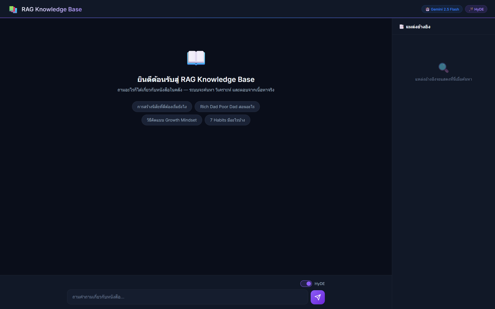
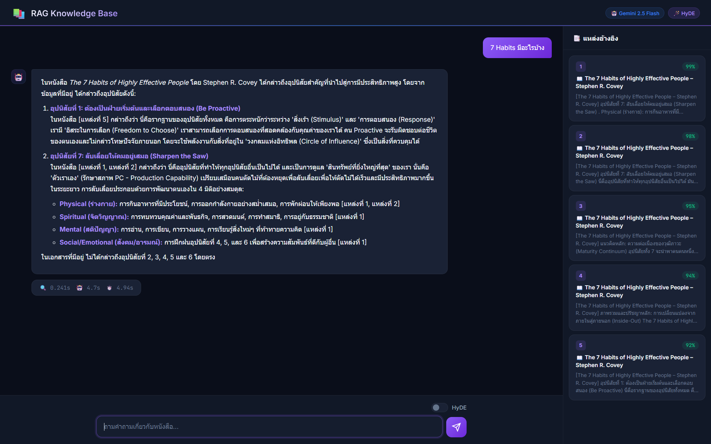
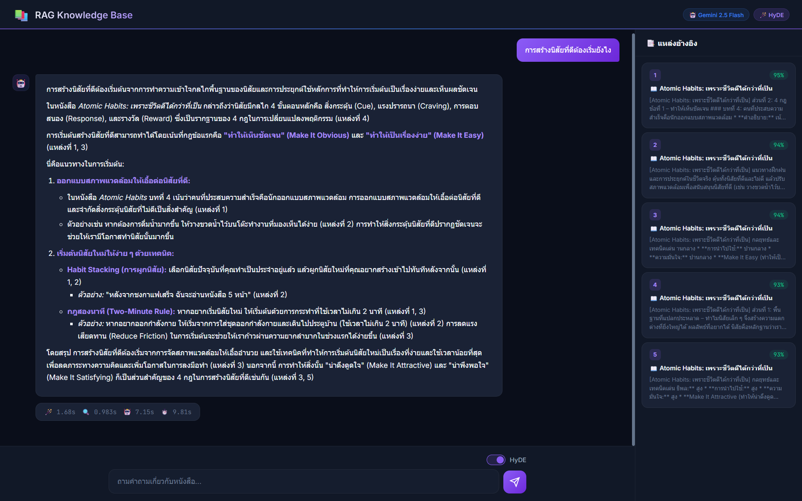
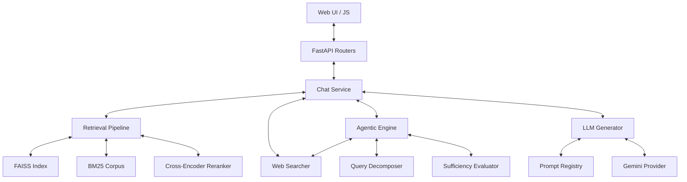

# 📚 RAG System — Full Pipeline Knowledge Base

ระบบค้นหาและตอบคำถามจากหนังสืออัจฉริยะ ผสม **HyDE Query Transform** + **Hybrid Search** + **Adaptive Reranking** + **Gemini LLM Generation** + **🧠 Agentic RAG** พร้อม **Premium Web UI (Gemini Style)** และระบบจัดการข้อมูลแบบครบวงจร

**Developed by [Aetox.dev](https://aetox.dev)**

> **สถานะ:** ✅ System Stable & Optimized (v4.1)  
> **Version:** 4.1 — Web Search (DuckDuckGo) + Sentence-Level Context Compression + Persona Management + Agentic Evaluation

📘 **[เอกสารเทคนิคฉบับเต็ม (Technical Guide)](docs/technical_guide.md)**
📘 **[แผนการพัฒนาระบบ (Sentence Compression Plan)](docs/sentence_compression_plan.md)**

---

## 📸 Screenshots

### หน้า Welcome — Dark Theme + Suggestion Chips


### ผลลัพธ์การค้นหา — คำตอบ + แหล่งอ้างอิง (ไม่เปิด HyDE)


### ผลลัพธ์ด้วย HyDE — Timing ครบทุก Stage


---

### 🏗️ Architecture (Modular Design)

ระบบถูกออกแบบใหม่เป็น **Modular & Service-Oriented Architecture** เพื่อความยืดหยุ่นและการขยายตัว:

1. **API Layer (`api/`)**: แยก Routing (Chat/Admin) และ SSE Handlers ออกจากกัน
2. **Service Layer (`services/`)**: Orchestrator หลักที่ประสานงานทุกโมดูล
3. **Retrieval Pipeline (`core/retrieval/`)**: แยกขั้นตอน Tokenize, Search (Dense/BM25) และ Rerank
4. **Agentic Engine (`core/agentic/`)**: แยก Business Logic ของการคิดวิเคราะห์ออกจาก UI
5. **LLM & Prompt Management (`core/llm/`, `core/prompts/`)**: แยก Prompt templates ออกเป็นไฟล์ และจัดการ LLM Provider อิสระ
6. **Web Searcher (`core/web_searcher.py`)**: ค้นหาข้อมูลจากอินเทอร์เน็ตแบบ Real-time (DuckDuckGo)


```mermaid
graph TD
    UI[Web UI / JS] <--> API[FastAPI Routers]
    API <--> CHAT[Chat Service]
    CHAT <--> RET[Retrieval Pipeline]
    CHAT <--> WEB[Web Searcher]
    CHAT <--> AGENT[Agentic Engine]
    CHAT <--> GEN[LLM Generator]
    
    AGENT <--> DEC[Query Decomposer]
    AGENT <--> EVAL[Sufficiency Evaluator]
    AGENT <--> WEB
    
    RET <--> FAISS[FAISS Index]
    RET <--> BM25[BM25 Corpus]
    RET <--> RERANK[Cross-Encoder Reranker]
    
    GEN <--> PROMPTS[Prompt Registry]
    GEN <--> PROVIDER[Gemini Provider]
```

### Pipeline Stages

| Stage | Method | หน้าที่ | ทำงานบน |
|-------|--------|---------|---------|
| **W1** | Web Search (DuckDuckGo) | 🌐 ค้นหาข้อมูลล่าสุดจากอินเทอร์เน็ต (ถ้าเปิดโหมด Web) | Cloud API |
| **0** | HyDE (Groq LLaMA) | สร้างเอกสารสมมติเพื่อปรับปรุงคำค้น | Cloud API |
| **1a** | Dense (FAISS) | จับ "ความหมาย" — คำต่างกันแต่หมายถึงเรื่องเดียวกัน | GPU |
| **1b** | BM25 (Sparse) | จับ "คำตรงกัน" — ชื่อคน, ชื่อหนังสือ, ศัพท์เฉพาะ | CPU |
| **2** | Score Merge | รวม Dense (70%) + BM25 (30%) แล้ว normalize | CPU |
| **3** | Adaptive Reranker | ⚡ Skip ถ้าชัด / 🔬 Rerank ถ้ากำกวม (gap ≤ 0.15) | GPU |
| **4** | Sentence Compressor | ✂️ ตัด Chunk เป็นประโยค + กรองหยาบ (Embedding) + จัดเรียงใหม่ (Cross-Encoder) ให้ได้ประโยคที่ตรงที่สุด | GPU |
| **5** | Gemini Generation | สร้างคำตอบ SSE streaming จากเนื้อหาที่ถูกบีบอัดแล้ว | Cloud API |
| **A1** | Query Decomposer | 🧠 แตกคำถามซับซ้อนเป็น sub-queries (Agentic) | Cloud API |
| **A2** | Evaluator | 📊 ประเมินว่าข้อมูลครบหรือยัง + สร้าง follow-up (Agentic) | Cloud API |
| **A3** | Balanced Selection | ⚖️ round-robin เลือก chunks จากทุก source (Agentic) | CPU |

---

## 📁 Project Structure

```
BookMind/
├── web_server.py           # 🚀 Entry Point: FastAPI App initialization
├── config.py               # ⚙️ Global App Config (Constants, Weights)
├── rag_creator.py          # 🔨 Index Builder (Indexing logic)
├── rag_searcher.py         # 🔍 Search Wrapper (Backward compatibility)
│
├── api/                    # 🌐 API Layer
│   ├── routes/             #   📄 FastAPI Routers (chat, admin)
│   └── sse_handlers.py     #   ⚡ SSE Event Generators (Classic/Agentic)
│
├── services/               # 🧠 Service Layer (Business Logic)
│   └── chat_service.py     #   Orchestrator for all search pipelines
│
├── core/                   # 📦 Core Engine Modules
│   ├── retrieval/          #   🔍 Modular Retrieval Pipeline
│   │   ├── tokenizer.py    #     Thai/English text tokenization
│   │   ├── reranker.py     #     Cross-Encoder Reranking logic
│   │   ├── base_search.py  #     Dense/BM25 low-level search
│   │   ├── compressor.py   #     ✂️ Sentence-Level Context Compressor
│   │   └── pipeline.py     #     Retrieval Pipeline orchestrator
│   │
│   ├── agentic/            #   🧠 Agentic Reasoning Engine
│   │   ├── engine.py       #     Pure multi-hop orchestration
│   │   ├── formatter.py    #     Thai UI message formatting
│   │   └── types.py        #     Shared data structures
│   │
│   ├── llm/                #   🤖 LLM Providers
│   │   ├── gemini_provider.py#     Gemini API with Key Rotation
│   │   └── generator.py    #     High-level Answer Generator
│   │
│   ├── prompts/            #   📜 Prompt Management
│   │   ├── prompt_registry.py#     Central prompt loader
│   │   └── *.txt           #     Prompt templates (system, agentic)
│   │
│   ├── config.py           #   🔐 Environment & Key loading
│   ├── key_manager.py      #   🔑 Key Rotation logic
│   ├── query_transformer.py#   🪄 HyDE (via Groq)
│   ├── document_loader.py  #   📄 File loader (Excel, PPTX, etc.)
│   └── agent_memory.py     #   💾 Working memory for Agentic mode
│
├── web/                    # 🎨 Frontend (HTML/CSS/JS)
├── data/                   # 📂 Source Documents
├── storage/                # 💾 Vector & Keyword Indices
└── .env                    # 🔐 API Keys
```

---

## 🛠️ การติดตั้งและตั้งค่า (Setup)

### 1. เตรียม Environment
```bash
# สร้าง Virtual Environment (ถ้ายังไม่มี)
python3 -m venv venv

# เปิดใช้งาน (Activate) Environment
source venv/bin/activate

# ติดตั้ง Dependencies
pip install -r requirements.txt
```

### 2. ตั้งค่า API Keys
- คัดลอกไฟล์ `.env.example` เป็น `.env`
- ใส่ API Keys ของ Gemini และ Groq ในไฟล์ `.env`

### 3. ตั้งค่า Discord Bot (กรณีใช้งาน)
- ไปที่ [Discord Developer Portal](https://discord.com/developers/applications/)
- เลือก Application ของคุณ > ไปที่เมนู **Bot**
- ภายใต้หัวข้อ **Privileged Gateway Intents** ให้เปิด **Message Content Intent** เป็น **On**
- บันทึกการเปลี่ยนแปลง (Save Changes)

---

---

## 🐳 WSL Networking Fix (for Ollama)

หากคุณใช้งานผ่าน **WSL2** และต้องการเชื่อมต่อกับ **Ollama ที่รันบน Windows** คุณอาจพบปัญหา `Connection refused` เนื่องจากการแยก Network ระหว่าง WSL และ Windows

เราได้เตรียมสคริปต์อัตโนมัติเพื่อแก้ปัญหานี้ (ตั้งค่า Environment และ Firewall ในคลิกเดียว):

```bash
chmod +x fix_ollama_network.sh
./fix_ollama_network.sh
```

> [!TIP]
> อ่านรายละเอียดเชิงลึกและวิธีแก้ปัญหาด้วยตนเองได้ที่: **[Developer Guide: Ollama WSL Fix](docs/DEVELOPER_OLLAMA_FIX.md)**

---

## 🚀 Quick Start

### 0. เตรียมข้อมูล (Data Preparation)
- นำไฟล์ข้อมูลที่คุณต้องการใช้ค้นหา (รองรับ `.jsonl`, `.pdf`, `.docx`, `.xlsx`, `.pptx`, `.md`, `.html`, `.csv`, `.svg`, `.txt`) ไปใส่ไว้ในโฟลเดอร์ `data/` (สร้างโฟลเดอร์ขึ้นมาหากไม่มี)
- หากยังไม่มี สามารถสร้างไฟล์ `.jsonl` ตัวอย่างที่มีโครงสร้างแบบนี้:
  ```json
  {"book_title": "หนังสือตัวอย่าง", "title": "บทที่ 1", "content": "เนื้อหาที่ต้องการให้อ่าน..."}
  ```

### 1. Build Index
```bash
python3 build_index.py            # สร้าง index ครั้งแรก
python3 build_index.py --force    # สร้างใหม่ (ลบของเก่า)
```
> [!NOTE]
> การรันครั้งแรกจะมีการดาวน์โหลดโมเดล Embedding และ Reranker ขนาดรวมประมาณ 4.5 GB จาก Hugging Face โดยอัตโนมัติ กรุณาตรวจสอบการเชื่อมต่ออินเทอร์เน็ต

### 2. CLI — Classic Pipeline
```bash
python3 ask.py                         # Interactive mode
python3 ask.py "สามก๊กสอนอะไร"          # Single question
python3 ask.py --no-hyde "วิธีสร้างนิสัย" # ไม่ใช้ HyDE
python3 ask.py --no-stream "Growth Mindset" # ไม่ streaming
```

### 3. CLI — 🧠 Agentic Pipeline (Multi-hop)
```bash
python3 ask.py --agentic "เปรียบเทียบ Rich Dad กับ Psychology of Money"
python3 ask.py --agentic "วิเคราะห์ความเชื่อมโยงระหว่าง Atomic Habits กับ 7 Habits"
python3 ask.py --agentic --no-hyde ".."  # Agentic ไม่ใช้ HyDE
```

### 4. Web UI
```bash
python3 web_server.py
# → Open http://localhost:8080
# → เปิด toggle 🧠 Agentic สำหรับคำถามซับซ้อน
```

### 5. Search Only (ไม่ต่อ LLM)
```bash
python3 search.py
python3 test_rag.py
python3 test_agentic.py             # Unit tests (agentic)
python3 test_agentic.py --live      # Live API tests
```

---

## ⚙️ Configuration

### RAG Tuning — `config.py`

```python
# Hybrid Search weights (must sum to 1.0)
HYBRID_DENSE_WEIGHT = 0.7    # Semantic meaning
HYBRID_BM25_WEIGHT  = 0.3    # Keyword matching

# Adaptive Reranking
RERANK_SCORE_GAP = 0.15      # Skip reranker if gap > threshold

# Search tuning
TOP_K_RETRIEVAL = 10    # FAISS candidates
TOP_K_DISPLAY   = 5     # Final results shown
ENABLE_HYDE     = True  # HyDE query transform on/off

# Sentence Compression
COMPRESSION_ENABLED = True
COMPRESSION_EMBEDDING_THRESHOLD = 0.45  
COMPRESSION_TOP_N_SIMPLE = 5            
COMPRESSION_TOP_N_COMPLEX = 12          

# 🧠 Agentic RAG
AGENTIC_MAX_ITERATIONS = 3        # Max search loop iterations
AGENTIC_SUFFICIENCY_THRESHOLD = 0.7  # Stop searching when confidence ≥ 0.7
AGENTIC_MAX_CHUNKS = 20           # Max total chunks across all iterations
```

### LLM & API Keys — `core/config.py` + `.env`

```bash
# .env
GEMINI_API_KEYS='key1,key2,...'    # Round-robin rotation
GROQ_API_KEYS='key1,key2,...'

# Optional overrides
GEMINI_MODEL=gemini-2.5-flash
GEMINI_TEMPERATURE=0.3
GROQ_MODEL=llama-3.3-70b-versatile
GROQ_TEMPERATURE=0.7
```

---

## 💾 VRAM Usage (RTX 4060 — 8 GB)

| Component | VRAM |
|-----------|------|
| e5-large (Embedding) | ~2.2 GB |
| bge-reranker-v2-m3 | ~2.2 GB |
| FAISS Index | ~0.01 GB |
| BM25 | 0 GB (CPU only) |
| CUDA overhead | ~0.8 GB |
| **Total** | **~5.2 / 8 GB** ✅ |

---

## 📊 Performance

| Metric | Classic | 🧠 Agentic (complex) |
|--------|---------|---------------------|
| Total Chunks | 5,738 | 5,738 |
| Embedding Dimension | 1,024 | 1,024 |
| Search Latency (skip rerank) | ~15ms | ~15ms × N sub-queries |
| Search Latency (with rerank) | ~300ms | ~300ms × N sub-queries |
| HyDE Transform | ~1.5s | ~1.5s × N sub-queries |
| LLM Generation | ~5-8s | ~8-15s (more context) |
| API Calls | 2 (HyDE + Gen) | 4-8 (Decompose + HyDE×N + Eval + Gen) |
| **Total** | **~7-10s** | **~15-30s** |

> 💡 คำถาม simple ใน Agentic mode จะ bypass ไป Classic pipeline → ไม่มี overhead เพิ่ม

---

## 🗺️ Roadmap

- [x] Dense Search (FAISS + e5-large)
- [x] Cross-Encoder Reranking (bge-reranker-v2-m3)
- [x] Intelligent Chunking (500 chars + 100 overlap)
- [x] Hybrid Search (Dense + BM25)
- [x] MD & SVG Support
- [x] Excel, CSV, PPTX & HTML Support (New!)
- [x] Adaptive Reranking (score-gap based skip/rerank)
- [x] LLM Generation (Gemini 2.5 Flash)
- [x] Query Transform (HyDE via Groq LLaMA 3.3 70B)
- [x] Web UI (FastAPI + SSE + Dark Theme)
- [x] API Key Rotation (round-robin)
- [x] 🧠 Agentic RAG — Query Decomposition + Multi-hop Retrieval
- [x] 📊 Sufficiency Evaluator — ประเมินข้อมูลครบหรือยัง
- [x] ⚖️ Balanced Chunk Selection — round-robin จากทุก source
- [x] 🎭 Persona Management — ระบบสลับบทบาท (ครู, นักกฎหมาย, นักบัญชี ฯลฯ)
- [x] 🎛️ Interactive Pill Toggles — สวิตช์เปิด/ปิด HyDE และ Agentic แบบใหม่ พร้อมเงื่อนไขการทำงานร่วมกัน
- [x] ✂️ Sentence-Level Context Compression — ลดขนาด context แต่รักษาความถูกต้อง
- [x] 🌐 Web Search (DuckDuckGo) — ค้นหาข้อมูลแบบ Real-time และแยก Pipeline ชัดเจน
- [x] 📄 Document Upload (TXT/MD via Web UI) — อัปโหลดไฟล์เพื่อคุยกับไฟล์โดยตรง
- [ ] Conversation Memory (multi-turn)
- [ ] Multi-Agent System (specialized agents per domain)

---

## 🛠️ Tech Stack

| Category | Technology |
|----------|-----------|
| Language | Python 3.12 |
| Embedding | sentence-transformers + e5-large |
| Vector DB | FAISS (GPU-accelerated) |
| Sparse Search | rank-bm25 |
| Reranker | CrossEncoder (bge-reranker-v2-m3) |
| LLM Generation | Gemini 2.5 Flash (via google-genai) |
| Query Transform | Groq LLaMA 3.3 70B |
| 🧠 Agentic RAG | Query Decomposition + Multi-hop + Evaluator |
| API Key Management | Round-robin rotation (KeyManager) |
| Web Backend | FastAPI + uvicorn |
| Web Frontend | Vanilla HTML/CSS/JS + SSE |
| Streaming | Server-Sent Events (SSE) |
| GPU | NVIDIA RTX 4060 (CUDA) |
| Data Format | JSONL |
