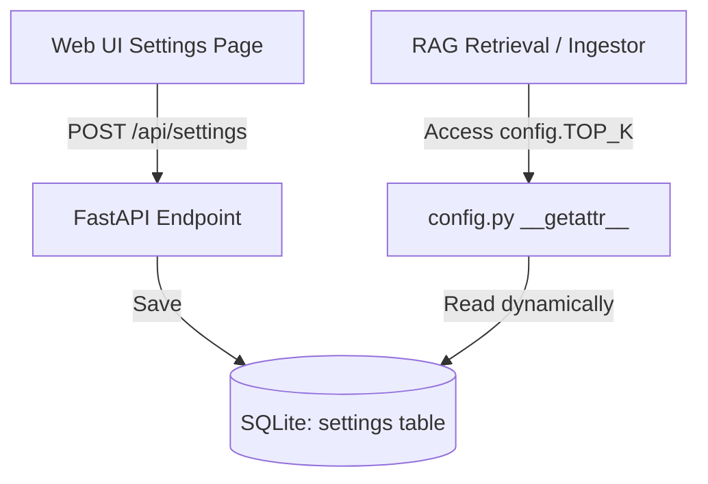

# แผนการปรับปรุง: ปรับขนาดข้อมูลและตั้งค่า RAG ผ่านหน้าเว็บโดยตรง (Dynamic RAG Tuning & Data Controls)

เป็นแนวคิดที่ยอดเยี่ยมมากครับ! การทำให้การควบคุมขนาดและสัดส่วนของข้อมูล (เช่น ขนาด Chunk, Top-K, และ Hybrid Weights) สามารถปรับแต่งได้จากหน้าเว็บจะช่วยให้ผู้ใช้ทั่วไปและผู้พัฒนาสามารถจูนระบบ RAG ให้เหมาะกับเอกสารแต่ละประเภทได้โดย **ไม่ต้องแก้ไขโค้ดหลังบ้าน** และ **ไม่ต้องรีสตาร์ทเซิร์ฟเวอร์**

ที่ผ่านมา ค่ากำหนดเหล่านี้ถูกเขียนทับตายตัว (Hardcoded) อยู่ใน `config.py` ทำให้ยากต่อการจูนระบบแบบ Real-time

---

## สรุปภาพรวมสถาปัตยกรรม (Architecture Overview)

เราจะเปลี่ยนให้ค่าคอนฟิกเหล่านั้นเป็น **Dynamic Settings** ที่ดึงค่ามาจากฐานข้อมูล SQLite (`bookmind.db`) เสมอ หากไม่มีค่าในฐานข้อมูลก็จะย้อนกลับไปใช้ค่าเริ่มต้น (Fallback to Defaults)

---

## สิ่งที่ต้องปรับปรุง (Proposed Changes)

เราจะแบ่งการปรับปรุงออกเป็น 3 ส่วนหลัก ดังนี้:

### 1. Backend Core & Dynamic Configuration

#### [MODIFY] [config.py](file:///Ubuntu/home/mikedev/BookMind/config.py)
- ย้ายค่ากำหนดที่เคยตายตัวทั้งหมดไปไว้ในพจนานุกรมเริ่มต้น (`_DEFAULTS`)
- ใช้ฟีเจอร์ระดับสูงของ Python **Module-level `__getattr__`** (PEP 562) เพื่อให้ทุกครั้งที่มีการเรียกใช้งานผ่าน `config.PARAMETER_NAME` ระบบจะดึงค่าแบบ Real-time จากฐานข้อมูล SQLite เสมอ โดยแปลงชนิดข้อมูล (Type conversion) ให้ถูกต้องโดยอัตโนมัติ
- วิธีนี้ทำให้เราไม่ต้องแก้ไขโครงสร้างการอิมพอร์ต (`import config`) ในไฟล์อื่นๆ เลยแม้แต่ไฟล์เดียว! และช่วยแก้ปัญหาการนำเข้าเป็นวงกลม (Circular Import) ระหว่าง `config.py` และ `database.py` ได้อย่างเด็ดขาด

#### [MODIFY] [rag_creator.py](file:///Ubuntu/home/mikedev/BookMind/rag_creator.py)
- ปรับเปลี่ยนคลาส `TextChunker` ให้ใช้ `@property` ในการดึงค่า `chunk_size` และ `chunk_overlap` จาก `config`
- เนื่องจากตัวแปรระบบ Ingestion ถูกสร้างขึ้นครั้งเดียวตอนเริ่มต้นรันเซิร์ฟเวอร์ การใช้ `@property` จะช่วยให้กระบวนการตัดคำใช้ขนาด Chunk ล่าสุดที่ตั้งค่าไว้ในหน้าเว็บในการประมวลผลไฟล์ใหม่ได้ทันที

---

### 2. Frontend User Interface

#### [MODIFY] [settings.html](file:///Ubuntu/home/mikedev/BookMind/web/settings.html)
- เพิ่มการ์ดตั้งค่าใหม่: **"📊 RAG Tuning & Data Controls (ขนาดข้อมูลและการค้นหา)"**
- ออกแบบ UI ที่สวยงาม มีระดับ ตามแนวทาง Modern Web Design ด้วยฟอร์มและคำแนะนำแต่ละค่า
- เพิ่มระบบ Interactive Autocalculation: เมื่อผู้ใช้ปรับน้ำหนักของ Dense Search (ความหมาย) ระบบจะคำนวณและอัปเดตน้ำหนักของ BM25 Search (คำสำคัญ) ให้รวมกันได้ 1.0 เสมอโดยอัตโนมัติ
- เพิ่มฟิลด์ควบคุมสำหรับรอบการทำงานและขีดจำกัดข้อมูลของโหมด Agentic RAG

---

## แผนการตรวจสอบและทดสอบ (Verification Plan)

### การทดสอบแบบ Manual
1. **การดึงค่าเริ่มต้นขึ้นมาแสดงผล**: เปิดหน้าตั้งค่าระบบ ตรวจสอบว่าระบบสามารถแสดงค่าเริ่มต้นที่กำหนดไว้ได้ถูกต้องหรือไม่
2. **การคำนวณสัดส่วนแบบ Dynamic**: ลองเลื่อนแถบหรือกรอกค่า `Hybrid Semantic Weight` ตรวจสอบว่าช่อง `Hybrid Keyword Weight` เปลี่ยนแปลงให้อยู่ในสัดส่วน 1.0 เสมอหรือไม่
3. **การบันทึกข้อมูล**: ทดลองปรับเปลี่ยนค่าต่างๆ แล้วกดปุ่ม "บันทึกการตั้งค่า" ตรวจสอบข้อความแจ้งเตือนและค่าที่บันทึกจริงในฐานข้อมูล
4. **การตรวจสอบผลลัพธ์แบบ Real-time**:
   - ลองปรับค่า `Top-K Display` บนเว็บ จาก 5 เป็น 2
   - ยิงคำถามเพื่อใช้งานระบบ Rerank ตรวจสอบใน Logs หรือหน้าการตอบกลับว่าระบบส่งข้อมูลมาแสดงเพียง 2 ชิ้นจริงโดยไม่ต้องรีสตาร์ทเซิร์ฟเวอร์
   - ลองปรับค่า `Chunk Size` และอัปโหลดไฟล์ใหม่ ตรวจสอบว่าจำนวน Chunk ที่ได้แปรผันตามขนาดตัวอักษรใหม่ที่ระบุไว้หรือไม่
