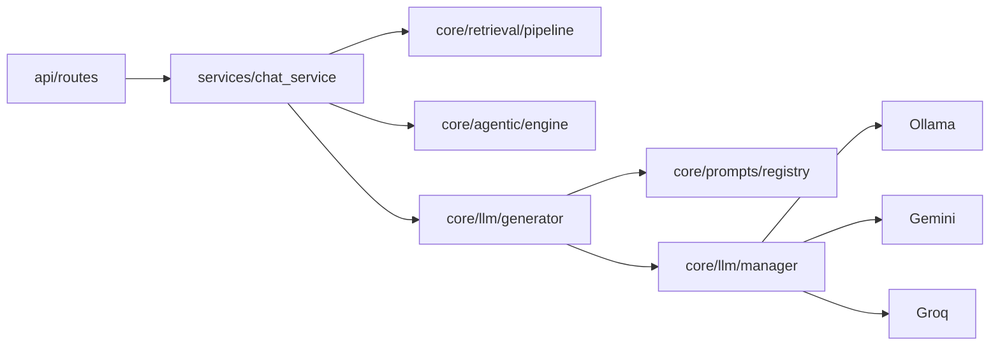
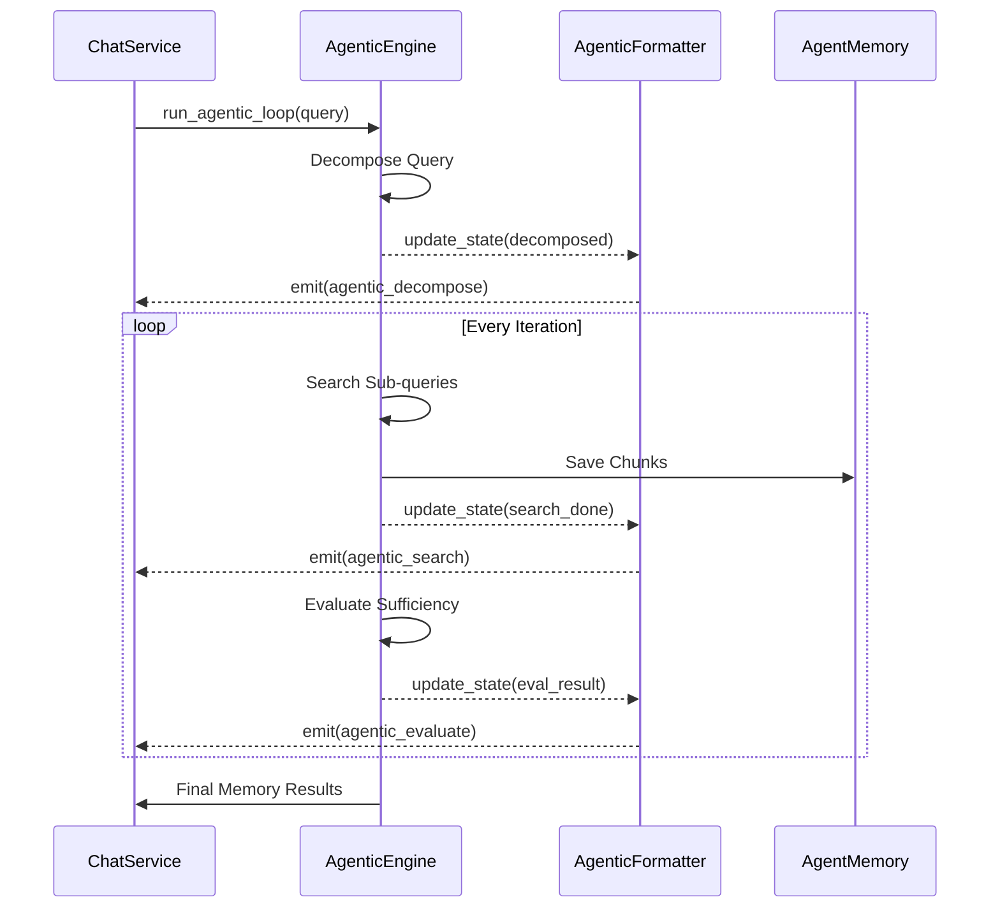

# 📘 เอกสารอธิบายระบบ RAG อย่างละเอียด
# RAG System — Technical Documentation (v3.0)

> เอกสารฉบับนี้อธิบายการทำงานของระบบ RAG (Retrieval-Augmented Generation) **แบบ End-to-End** ทุกขั้นตอน
> ครอบคลุมตั้งแต่ Query Transform (HyDE), Hybrid Search, Adaptive Reranking, LLM Generation (Gemini), **🧠 Agentic RAG** (Query Decomposition + Multi-hop Retrieval), จนถึง Web UI

---

## สารบัญ

1. [ภาพรวมระบบ](#1-ภาพรวมระบบ)
2. [Data Pipeline — การจัดการข้อมูล](#2-data-pipeline--การจัดการข้อมูล)
3. [Chunking — การแบ่งเอกสาร](#3-chunking--การแบ่งเอกสาร)
4. [Embedding — การแปลงข้อความเป็น Vector](#4-embedding--การแปลงข้อความเป็น-vector)
5. [FAISS Index — ฐานข้อมูล Vector](#5-faiss-index--ฐานข้อมูล-vector)
6. [BM25 — Keyword Search](#6-bm25--keyword-search)
7. [Hybrid Search — การค้นหาแบบผสม](#7-hybrid-search--การค้นหาแบบผสม)
8. [Reranker + Adaptive Reranking — การจัดอันดับซ้ำอัจฉริยะ](#8-reranker--adaptive-reranking--การจัดอันดับซ้ำอัจฉริยะ)
9. [Search Pipeline แบบเต็ม](#9-search-pipeline-แบบเต็ม)
10. [HyDE — Query Transform](#10-hyde--query-transform)
11. [LLM Generation — Gemini](#11-llm-generation--gemini)
12. [Core Package — API Keys & Modules](#12-core-package--api-keys--modules)
13. [Web UI — FastAPI + SSE](#13-web-ui--fastapi--sse)
14. [โครงสร้างไฟล์และหน้าที่](#14-โครงสร้างไฟล์และหน้าที่)
15. [Configuration — การตั้งค่า](#15-configuration--การตั้งค่า)
16. [ทรัพยากรที่ใช้ (VRAM/RAM)](#16-ทรัพยากรที่ใช้-vramram)
17. [ข้อมูลโมเดล AI](#17-ข้อมูลโมเดล-ai)
18. [Flow Chart — ภาพรวมทุกขั้นตอน](#18-flow-chart--ภาพรวมทุกขั้นตอน)
19. [🧠 Agentic RAG — Multi-hop Retrieval](#19-agentic-rag--multi-hop-retrieval)

---

## 1. ภาพรวมระบบ

### RAG คืออะไร?

**RAG (Retrieval-Augmented Generation)** คือสถาปัตยกรรม AI ที่แบ่งเป็น 2 ขั้นตอนหลัก:

1. **Retrieval (ค้นหา):** ค้นหาข้อมูลที่เกี่ยวข้องจากฐานความรู้
2. **Generation (สร้างคำตอบ):** ส่งข้อมูลที่ค้นเจอให้ LLM สรุปเป็นคำตอบ

> ✅ **ระบบปัจจุบัน** ครบทั้ง Retrieval + Generation + Agentic RAG (v3.0)
> Classic: HyDE → Hybrid Search → Adaptive Reranking → Gemini Generation → Web UI
> 🧠 Agentic: Decompose → Multi-hop Search → Evaluate → Balanced Select → Generate

### ทำไมต้อง RAG?

| ปัญหาของ LLM ปกติ | RAG แก้ได้อย่างไร |
|-------------------|-----------------|
| ข้อมูลเก่า (training cutoff) | ค้นจากข้อมูลล่าสุดได้ |
| หลอน (Hallucination) | มีแหล่งอ้างอิงจริง |
| ไม่รู้ข้อมูลเฉพาะทาง | ค้นจากฐานความรู้ส่วนตัว |
| ข้อมูลส่วนตัวรั่วไหล | ข้อมูลอยู่ในเครื่องเท่านั้น |

---

## 2. Data Pipeline — การจัดการข้อมูล

### ข้อมูลต้นทาง

ข้อมูลเก็บอยู่ในโฟลเดอร์ `data/` เป็นไฟล์ `.jsonl` (JSON Lines) หนึ่งบรรทัด = หนึ่งรายการ

**ตัวอย่างข้อมูล (.jsonl):**
```json
{
  "book_title": "Atomic Habits",
  "title": "กฎข้อที่ 1: ทำให้มันชัดเจน",
  "content": "การสร้างนิสัยที่ดีเริ่มต้นจากการทำให้สิ่งกระตุ้นนั้นชัดเจน..."
}
```

### ขั้นตอนการอ่านข้อมูล

```
data/
├── atomic_habits.jsonl     → อ่านทุกบรรทัด
├── three_kingdoms.jsonl    → อ่านทุกบรรทัด
├── rich_dad.jsonl          → อ่านทุกบรรทัด
└── ... (120 ไฟล์)
```

**กระบวนการ:**
1. วนอ่านทุกไฟล์ `.jsonl` ในโฟลเดอร์ `data/`
2. แต่ละบรรทัด parse เป็น JSON
3. ดึง 3 field มารวมกัน:
   - `book_title` → แท็กชื่อหนังสือ เช่น `[Atomic Habits]`
   - `title` → หัวข้อย่อย
   - `content` → เนื้อหาหลัก
4. ส่งเข้า Chunking pipeline

**ไฟล์ที่เกี่ยวข้อง:** `rag_creator.py` → method `_load_jsonl()`

---

## 3. Chunking — การแบ่งเอกสาร

### ทำไมต้อง Chunk?

Embedding model (e5-large) ทำงานได้ดีที่สุดกับข้อความขนาด **~500 ตัวอักษร** ถ้าข้อความยาวเกินไป:
- Model จะ "เฉลี่ย" ความหมายจนไม่ชัดเจน
- ค้นหาไม่ตรงจุด (เจอเอกสารที่ "พอเกี่ยว" แต่ไม่ตรง)

ถ้าข้อความสั้นเกินไป:
- ขาดบริบท ไม่เข้าใจความหมาย

### Chunking Strategy ของระบบ

```
ต้นฉบับ (เนื้อหา 1 entry ใน JSONL):
┌─────────────────────────────────────────────────┐
│ [Atomic Habits]                                 │
│ กฎข้อที่ 1: ทำให้มันชัดเจน                        │
│                                                 │
│ การสร้างนิสัยที่ดีเริ่มต้นจากการทำให้สิ่งกระตุ้น   │
│ นั้นชัดเจน วิธีที่ดีที่สุดคือ...                   │
│ (ข้อความยาว 2,000 ตัวอักษร)                       │
└─────────────────────────────────────────────────┘
                    │
                    ▼  Chunker (500 chars, overlap 100)
    ┌──────────────────────────────────┐
    │ Chunk 1 (500 chars)             │
    │ [Atomic Habits]                 │
    │ กฎข้อที่ 1: ทำให้มันชัดเจน       │
    │ การสร้างนิสัยที่ดีเริ่มต้น...     │
    ├──────┤◄── overlap 100 chars     │
    │ Chunk 2 (500 chars)             │
    │ [Atomic Habits]                 │
    │ ...ต้นจากการทำให้สิ่งกระตุ้นนั้น  │
    │ ชัดเจน วิธีที่ดีที่สุดคือ...      │
    ├──────┤◄── overlap 100 chars     │
    │ Chunk 3 (500 chars)             │
    │ [Atomic Habits]                 │
    │ ...ที่สุดคือการใช้ implementation │
    │ intention โดยระบุว่า...          │
    └──────────────────────────────────┘
```

### Chunking Strategy: Iterative Sliding Window (v3.5)

เพื่อให้ข้อมูลถูกเก็บครบ 100% ระบบได้อัปเกรดเป็นเทคนิค **Iterative Sliding Window** (ขยับหน้าต่างทีละ 400 chars, overlap 100)

1. **Window-based**: แบ่งเนื้อหาเป็นหน้าต่างขนาด 500 ตัวอักษร
2. **Iterative Step**: เมื่อจบ Chunk ระบบจะขยับไปข้างหน้าเพียง 400 ตัวอักษร (Overlap 100)
3. **No Truncation**: ทำซ้ำไปเรื่อยๆ จนถึงตัวอักษรสุดท้าย การันตีว่าไม่มีข้อความส่วนไหนถูกตัดทิ้ง

### ลำดับการเลือกจุดตัด (Inside Window):
1. **ตัดที่ย่อหน้า (`\n`)** — รักษาบริบทได้ดีที่สุด
2. **ตัดที่จุดจบประโยค (`.` `。` `!` `?`)** — ถ้าย่อหน้ายาวเกินไป
3. **ตัดตามจำนวนตัวอักษร** — ทางเลือกสุดท้าย (Hard-cut) หากไม่พบจุดตัดธรรมชาติภายในระยะที่กำหนด

### Overlap คืออะไร?

**Overlap** = ส่วนที่ซ้ำกันระหว่าง chunk ต่อกัน

```
Chunk 1: [AAAAAAAAAA|BBBB]
                     ↕ overlap 100 chars
Chunk 2:            [BBBB|CCCCCCCCCC]
```

**ทำไมต้องมี Overlap?**
- ป้องกัน "ข้อมูลหาย" ตรงรอยตัด
- ถ้าคำตอบอยู่ตรงรอยต่อพอดี → ยังเจอใน chunk ใดเช่นหนึ่ง

### Metadata Prefix

ทุก chunk จะมี **ชื่อหนังสือ + หัวข้อ** แนบไว้ด้านบนเสมอ:

```
[Atomic Habits]              ← book_title
กฎข้อที่ 1: ทำให้มันชัดเจน    ← title
การสร้างนิสัยที่ดีเริ่มต้น...  ← content (chunked)
```

สิ่งนี้ช่วยให้:
- Embedding จับบริบท "หนังสือเล่มไหน" ได้
- BM25 ค้นชื่อหนังสือตรงๆ ได้

**ไฟล์ที่เกี่ยวข้อง:** `rag_creator.py` → class `TextChunker`

**ค่าตั้ง:** `config.py` → `CHUNK_SIZE = 500`, `CHUNK_OVERLAP = 100`

---

## 4. Embedding — การแปลงข้อความเป็น Vector

### หลักการ

**Embedding** คือการแปลงข้อความเป็น "เวกเตอร์ตัวเลข" ที่แทนความหมาย

```
"วิธีสร้างนิสัยที่ดี"  →  [0.0234, -0.1456, 0.3421, ..., 0.0891]
                            (1,024 มิติ)
```

ข้อความที่มีความหมายใกล้เคียงกัน → จะมี vector ที่ชี้ไปทิศทางเดียวกัน:

```
"วิธีสร้างนิสัยที่ดี"        → [0.82, 0.34, ...]  ─┐
"การพัฒนาพฤติกรรมประจำวัน"  → [0.80, 0.31, ...]  ─┤ ใกล้กัน!
                                                    │
"ราคาทองคำวันนี้"          → [-0.12, 0.95, ...] ─┘ ไกลมาก!
```

### โมเดลที่ใช้: `intfloat/multilingual-e5-large`

| คุณสมบัติ | รายละเอียด |
|-----------|-----------|
| Parameters | ~560 ล้าน |
| Dimension | 1,024 |
| ภาษา | 100+ ภาษา (รวมไทย) |
| Benchmark | MTEB Top-tier |
| ขนาด | ~2.2 GB |

### 🎓 Deep Dive: ทำไมเลือก E5-Large?

โมเดล Embedding มีหลายตัวเลือก — เช่น `all-MiniLM-L6` (เร็วแต่เล็ก), `BGE-M3` (ใหญ่มาก), `E5-Large` (สมดุล)

เราเลือก **E5-Large** เพราะ:

| ปัจจัย | E5-Large | MiniLM-L6 | BGE-M3 |
|--------|----------|-----------|--------|
| **ภาษาไทย** | ✅ ดีมาก | ❌ อ่อน | ✅ ดีมาก |
| **VRAM** | 2.2 GB | 0.3 GB | 4+ GB |
| **Dimension** | 1,024 | 384 | 1,024 |
| **ความแม่นยำ** | ⭐⭐⭐⭐⭐ | ⭐⭐⭐ | ⭐⭐⭐⭐⭐ |
| **เข้ากับ RTX 4060** | ✅ พอดี | ✅ เหลือเยอะ | ⚠️ แน่นมาก |

**สรุป:** E5-Large เป็นจุดสมดุลที่ดีที่สุดระหว่างความแม่นยำและ VRAM

### 🎓 Deep Dive: Contrastive Learning คืออะไร?

E5 ถูกฝึกด้วย **Contrastive Learning** — วิธีการสอนโมเดลที่ชาญฉลาด:

```
หลักการ:
- ให้โมเดลดูคู่ข้อความ "ที่เกี่ยวกัน" (positive pair)
- และคู่ข้อความ "ที่ไม่เกี่ยว" (negative pair)
- สอนให้โมเดล ดัน positive ให้ใกล้กัน และ ผลัก negative ให้ไกลกัน

ตัวอย่าง (ขณะฝึก):
✅ Positive: ("วิธีสร้างนิสัย", "การพัฒนาพฤติกรรม") → ดันเข้าหากัน
❌ Negative: ("วิธีสร้างนิสัย", "ราคาทองคำ")     → ผลักออก

ผลลัพธ์:
- โมเดลเรียนรู้ "ความหมาย" ไม่ใช่แค่ "คำ"
- ข้อความที่หมายความเหมือนกันแต่ใช้คำต่างกัน → vector ใกล้กัน!
```

> 💡 **ทำไมถึงสำคัญ?** ถ้าใช้โมเดลที่ฝึกด้วย MLM (เช่น BERT ดิบ) แทน Contrastive Learning จะได้ embedding ที่ "คล้ายกันหมด" ไม่สามารถแยกแยะความหมายได้ดี — นี่คือเหตุผลที่เราไม่ใช้ BERT ดิบทำ Semantic Search

### E5 Prefix Convention

โมเดล E5 ใช้ prefix พิเศษเพื่อบอกว่าเป็น "เอกสาร" หรือ "คำถาม":

```python
# ตอนสร้าง index (เอกสาร)
"passage: [Atomic Habits]\nกฎข้อที่ 1..."

# ตอนค้นหา (คำถาม)
"query: วิธีสร้างนิสัยที่ดี"
```

สิ่งนี้ช่วยให้ model เข้าใจ "บทบาท" ของข้อความ → ให้ผลลัพธ์ดีขึ้น 10-15%

> 🎓 **เบื้องหลัง:** prefix นี้เป็นส่วนหนึ่งของ "Instruction-tuned Embedding" — โมเดลถูกฝึกให้เข้าใจว่า `query:` หมายถึง "คำถามที่ต้องการคำตอบ" และ `passage:` หมายถึง "เอกสารที่อาจมีคำตอบ" ช่วยให้ vector space จัดเรียงตัวได้สอดคล้องกับงาน retrieval มากขึ้น

### กระบวนการ Encoding

```
5,738 chunks
    │
    ▼  Batch encoding (batch_size=32)
    │
    ├── Batch 1: chunks[0:32]    → embeddings[0:32]
    ├── Batch 2: chunks[32:64]   → embeddings[32:64]
    ├── ...
    └── Batch 180: chunks[5728:5738] → embeddings[5728:5738]
    │
    ▼
Matrix: (5,738 × 1,024) float32
= ~23.5 MB ข้อมูล vector
```

**ไฟล์ที่เกี่ยวข้อง:** `rag_creator.py` → `build_and_save()` ใช้ `model.encode()`

---

## 5. FAISS Index — ฐานข้อมูล Vector

### FAISS คืออะไร?

**FAISS (Facebook AI Similarity Search)** เป็นไลบรารีจาก Meta AI สำหรับค้นหา vector ที่ใกล้เคียงกันในเวลาเร็วมาก

> 🎓 **Nearest Neighbor Search:** ปัญหาหลักของ vector search คือ "หา vector ที่ใกล้ที่สุด" จากหมื่น/ล้าน vectors — ถ้าเทียบทีละตัว (brute-force) จะช้ามาก แต่ FAISS ใช้เทคนิคจาก computer science เพื่อเร่งความเร็ว เช่น GPU parallelism, quantization, และ index clustering

### ชนิด Index ที่ใช้: `IndexFlatIP`

```
IndexFlatIP = Inner Product (Cosine Similarity เมื่อ normalize แล้ว)
```

| คุณสมบัติ | รายละเอียด |
|-----------|-----------|
| Algorithm | Brute-force (ค้นทุก vector) |
| Accuracy | 100% (exact search) |
| Speed | เร็วมากด้วย GPU |
| เหมาะกับ | Dataset < 1 ล้าน vectors |

### 🎓 Deep Dive: Inner Product vs L2 Distance

มี 2 วิธีหลักในการวัด "ความใกล้เคียง" ของ vector:

```
Inner Product (IP):  คำนวณ dot product ของ 2 vectors
  → ค่าสูง = ความหมายใกล้กัน
  → เมื่อ normalize แล้ว = เทียบเท่า Cosine Similarity

L2 Distance (Euclidean): คำนวณ "ระยะห่าง" ระหว่าง 2 จุด
  → ค่าต่ำ = ความหมายใกล้กัน
  → ถ้า normalize แล้ว ผลเหมือน IP ทุกกรณี
```

**ทำไมเลือก Inner Product?**
- E5 model ออกแบบมาให้ใช้กับ cosine similarity
- เราทำ L2-normalize ก่อนใส่ FAISS → IP = cosine similarity ทุกกรณี
- Inner Product **เร็วกว่า** L2 บน GPU เพราะใช้ matrix multiplication ซึ่ง GPU ถนัดมาก

### 🎓 Deep Dive: ทำไม GPU ถึงเร็วกว่า CPU?

```
CPU: เก่งงานซับซ้อน แต่ทำทีละน้อย (8-16 cores)
     → ค้น 5,738 vectors ≈ 10-50ms

GPU: เก่งงานง่ายๆ แต่ทำพร้อมกันเป็นพัน (4,096+ cores)
     → ค้น 5,738 vectors ≈ 1-5ms

Vector search = "คูณ matrix + เรียงลำดับ" → GPU ถนัดมาก!
```

> ⚡ **ผลจริง:** ในระบบเรา GPU เร็วกว่า CPU **5-10 เท่า** สำหรับ 5,738 vectors

### กระบวนการค้นหา

```
Query vector (1 × 1,024)
    │
    ▼  Inner Product กับทุก vector ใน index
    │
Index vectors (5,738 × 1,024)
    │
    ▼  Sort by score
    │
Top-10 results (indices + scores)
```

**เวลาค้น:** ~1-5 มิลลิวินาที (GPU) สำหรับ 5,738 vectors

### ไฟล์ที่บันทึก

```
storage/
├── RAG_system.faiss        # FAISS index (vector data)
├── RAG_system_data.pkl     # ข้อความ chunk ต้นฉบับ (5,738 entries)
└── RAG_system_bm25.pkl     # Tokenized corpus สำหรับ BM25
```

---

## 6. BM25 — Keyword Search

### BM25 คืออะไร?

**BM25 (Best Matching 25)** เป็นอัลกอริทึมค้นหาแบบ keyword ที่ดีที่สุด (คิดค้นปี 1994 แต่ยังใช้กันทั่วโลก)

### หลักการทำงาน

BM25 ให้คะแนนเอกสารตาม 3 ปัจจัย:

```
Score = TF × IDF × Length_Normalization
```

| ปัจจัย | ความหมาย | ตัวอย่าง |
|--------|---------|---------|
| **TF** (Term Frequency) | คำนี้ปรากฏในเอกสารกี่ครั้ง | "นิสัย" ปรากฏ 5 ครั้ง → คะแนนสูง |
| **IDF** (Inverse Document Frequency) | คำนี้หายากแค่ไหนในทุกเอกสาร | "Atomic Habits" อยู่แค่ไม่กี่ chunk → คะแนนสูง |
| **Length Norm** | ปรับตามความยาวเอกสาร | เอกสารสั้นที่มีคำตรง → ได้คะแนนมากกว่าเอกสารยาว |

### ตัวอย่างจริง

```
Query: "Atomic Habits"

Chunk A: "[Atomic Habits] กฎข้อที่ 1..."
  → TF: "Atomic" ✅ "Habits" ✅
  → IDF: คำว่า "Atomic Habits" หายาก → คะแนนสูงมาก!
  → Score: 8.5

Chunk B: "[สามก๊ก] กลยุทธ์สงคราม..."
  → TF: ไม่มีคำตรงกันเลย
  → Score: 0.0
```

### Tokenization สำหรับภาษาไทย

เนื่องจากภาษาไทยไม่มีช่องว่างระหว่างคำ ระบบใช้ **regex-based tokenizer**:

```python
def tokenize_thai(text):
    # จับคำไทย + คำอังกฤษ/ตัวเลข
    tokens = re.findall(r'[\u0E00-\u0E7F]+|[a-zA-Z0-9]+', text.lower())
    # กรองคำที่สั้นเกิน (1 ตัวอักษร)
    return [t for t in tokens if len(t) > 1]
```

**ตัวอย่าง:**
```
Input:  "[Atomic Habits] กฎข้อที่ 1: ทำให้มันชัดเจน"
Tokens: ["atomic", "habits", "กฎข้อที่", "ทำให้", "มัน", "ชัดเจน"]
```

> 📝 **หมายเหตุ:** tokenizer ปัจจุบันใช้ regex ซึ่ง "ดีพอ" สำหรับ BM25
> ถ้าต้องการความแม่นยำสูงขึ้น สามารถเปลี่ยนเป็น `PyThaiNLP` ในอนาคต

**ไฟล์ที่เกี่ยวข้อง:** `rag_creator.py` → `tokenize_thai()`, `rag_searcher.py` → `_bm25_search()`

---

## 7. Hybrid Search — การค้นหาแบบผสม

### ทำไมต้อง Hybrid?

| สถานการณ์ | Dense Search | BM25 | Hybrid |
|-----------|-------------|------|--------|
| "วิธีสร้างนิสัย" | ✅ เข้าใจความหมาย | ⚠️ อาจไม่มีคำตรง | ✅ |
| "Atomic Habits" | ⚠️ อาจเจอหนังสืออื่น | ✅ จับชื่อตรง | ✅ |
| "Jensen Huang พูดอะไร" | ⚠️ | ✅ จับชื่อคน | ✅ |
| "ปรัชญาเรื่องการลงทุน" | ✅ จับความหมายนามธรรม | ❌ | ✅ |

**Hybrid = ได้ข้อดีของทั้งสองโลก**

### วิธีรวมคะแนน

```
Query: "Atomic Habits สอนอะไร"
                │
        ┌───────┴───────┐
        ▼               ▼
   Dense Search     BM25 Search
   (FAISS)          (rank-bm25)
        │               │
        ▼               ▼
   Raw Scores       Raw Scores
   [0.85, 0.72,    [8.5, 0.0,
    0.68, 0.45]     6.2, 3.1]
        │               │
        ▼               ▼
   Normalize 0-1    Normalize 0-1
   [1.0, 0.68,     [1.0, 0.0,
    0.58, 0.0]      0.73, 0.36]
        │               │
        └───────┬───────┘
                ▼
        Weighted Merge
        Dense × 0.7 + BM25 × 0.3
        │
        ▼
   [1.0×0.7 + 1.0×0.3 = 1.00,    ← Chunk A (ทั้งคู่เห็นด้วย!)
    0.68×0.7 + 0.0×0.3 = 0.48,
    0.58×0.7 + 0.73×0.3 = 0.63,  ← Chunk C (BM25 ช่วยดันขึ้น!)
    0.0×0.7 + 0.36×0.3 = 0.11]
```

### Weight ที่ใช้

| Weight | ค่า | เหตุผล |
|--------|-----|--------|
| `HYBRID_DENSE_WEIGHT` | **0.7** | ข้อมูลเป็นหนังสือ → ความหมายสำคัญกว่าคำตรง |
| `HYBRID_BM25_WEIGHT` | **0.3** | สำรองไว้จับชื่อเฉพาะ |

> 💡 **Tuning Tip:** ถ้าข้อมูลมีชื่อเฉพาะเยอะ (เช่น FAQ, glossary) → เพิ่ม BM25 เป็น 0.4-0.5

### Score Normalization

ก่อนรวม Dense + BM25 ต้อง **normalize** ก่อน เพราะ:
- Dense scores: อยู่ในช่วง 0–1 (cosine similarity)
- BM25 scores: อยู่ในช่วง 0–∞ (ไม่มีขอบเขต)

**วิธี: Min-Max Normalization**
```
normalized = (score - min) / (max - min)
```

ทำให้ทั้งสองอยู่ในช่วง 0–1 ก่อนรวมด้วย weight

**ไฟล์ที่เกี่ยวข้อง:** `rag_searcher.py` → `_hybrid_merge()`, `_normalize_scores()`

**ค่าตั้ง:** `config.py` → `HYBRID_DENSE_WEIGHT`, `HYBRID_BM25_WEIGHT`

---

## 8. Reranker + Adaptive Reranking — การจัดอันดับซ้ำอัจฉริยะ

### ทำไมต้อง Rerank?

**ปัญหาของ Stage 1 (Retrieval):**
- Dense Search ใช้ **Bi-Encoder** — encode query กับ document แยกกัน → เร็ว แต่ไม่แม่นที่สุด
- BM25 นับแค่คำ → ไม่เข้าใจบริบท

**Reranker ใช้ Cross-Encoder** — ให้คะแนนคู่ (query, document) พร้อมกัน:

```
Bi-Encoder (Stage 1):              Cross-Encoder (Stage 2):

 Query → [Encoder] → vec_q          Query ──┐
                      ↕ similarity           ├→ [Encoder] → Score
 Doc   → [Encoder] → vec_d          Doc   ──┘

 เร็ว แต่ไม่แม่น 100%              ช้ากว่า แต่แม่นมาก!
```

### ทำไม Cross-Encoder แม่นกว่า?

เพราะมัน "อ่าน" query และ document **พร้อมกัน** ทำให้เข้าใจ:
- คำไหนในเอกสาร "ตอบ" คำถามโดยตรง
- บริบทรอบข้างของคำ
- ความสัมพันธ์ระหว่างคำถามกับเนื้อหา

### โมเดลที่ใช้: `BAAI/bge-reranker-v2-m3`

| คุณสมบัติ | รายละเอียด |
|-----------|-----------|
| Architecture | XLM-RoBERTa (Cross-Encoder) |
| Parameters | ~568 ล้าน |
| ภาษา | 100+ ภาษา (รวมไทย) |
| Version | v2-m3 (ล่าสุด, multilingual) |
| ขนาด | ~2.2 GB |

### กระบวนการ Reranking

```
จาก Hybrid Merge: 10 candidates
    │
    ▼  สร้างคู่ (query, doc) ทุกคู่
    │
    ├── (query, chunk_A) → Score: 0.92
    ├── (query, chunk_C) → Score: 0.87
    ├── (query, chunk_B) → Score: 0.45
    ├── ...
    │
    ▼  Sort by score (descending)
    │
    Top-5 Final Results
```

### Adaptive Reranking — ข้าม Reranker เมื่อไม่จำเป็น

ระบบ production ระดับโลกไม่ได้ rerank ทุก query — มันตรวจสอบก่อนว่า "จำเป็นไหม?"

**หลักการ:** ถ้า Hybrid Search ให้ผลลัพธ์ที่ **Top-1 ทิ้งห่าง Top-2 มาก** (score gap สูง) แสดงว่าผลลัพธ์ชัดเจนอยู่แล้ว → ข้าม Reranker ได้

```
Hybrid Merge Scores
        │
        ▼
   Gap = Top-1 - Top-2
        │
   ┌────┴────┐
   ▼         ▼
 Gap > 0.15  Gap ≤ 0.15
 (ชัดเจน)    (กำกวม)
   │         │
   ▼         ▼
 ⚡ Skip     🔬 Rerank
 ~15ms      ~300ms
```

### ผลทดสอบจริง (Benchmark)

| Query | Gap | Mode | เวลา | ทำไม? |
|-------|-----|------|------|-------|
| "Atomic Habits สอนอะไร..." | 0.032 | 🔬 Rerank | 0.576s | หลาย chunk ของเล่มเดียวกันแข่งกัน |
| "Rich Dad Poor Dad..." | 0.248 | ⚡ Skip | **0.020s** | ชัดเจน → ข้ามได้ |
| "วิธีเจรจาต่อรอง" | 0.428 | ⚡ Skip | **0.015s** | Top-1 ทิ้งห่างมาก |
| "วิธีฝึกสมาธิ..." | 0.092 | 🔬 Rerank | 0.190s | หลายหนังสือเกี่ยวข้องพอๆ กัน |
| "ซุนวูสอนอะไร..." | 0.175 | ⚡ Skip | **0.015s** | ซุนวูชัดเจน |

**ผลสรุป:** 3 ใน 5 queries ข้าม Reranker ได้ = ประหยัด GPU ~60% โดยไม่เสียความแม่นยำ

> 💡 **Tuning Tip:**
> - `RERANK_SCORE_GAP = 0.10` → rerank บ่อยขึ้น (แม่นกว่า แต่ช้ากว่า)
> - `RERANK_SCORE_GAP = 0.20` → skip บ่อยขึ้น (เร็วกว่า แต่เสี่ยงกว่า)
> - `RERANK_SCORE_GAP = 0.00` → rerank ทุกครั้ง (ปิด Adaptive)

**ไฟล์ที่เกี่ยวข้อง:** `rag_searcher.py` → `_should_rerank()`, `search()`

**ค่าตั้ง:** `config.py` → `RERANK_SCORE_GAP = 0.15`

---

## 9. Search Pipeline แบบเต็ม

### End-to-End Flow

```
User: "Atomic Habits สอนวิธีสร้างนิสัยอย่างไร"
│
▼ Stage 1a: Dense Search (GPU)
│  query → e5-large → query_vector
│  query_vector × FAISS index → Top 10 (by cosine similarity)
│  ⏱️ ~5ms
│
▼ Stage 1b: BM25 Search (CPU)
│  query → tokenize → ["atomic", "habits", "สอน", "วิธี", "สร้าง", "นิสัย"]
│  BM25.get_scores(tokens) → Top 10 (by TF-IDF)
│  ⏱️ ~1ms
│
▼ Stage 2: Score Merge
│  Dense scores: normalize to 0-1, weight × 0.7
│  BM25 scores:  normalize to 0-1, weight × 0.3
│  merged = dense + bm25 → Top 10 unique candidates
│  ⏱️ ~0.1ms
│
▼ Stage 3: Adaptive Reranking Decision
│  gap = Top-1 score - Top-2 score
│  ┌──────────────────────────┐
│  │ gap > 0.15 → ⚡ Skip!   │  ← Fast mode (~15ms total)
│  │ gap ≤ 0.15 → 🔬 Rerank │  ← Precision mode (~300ms)
│  └──────────────────────────┘
│  If Reranking: 10 pairs → bge-reranker-v2-m3.predict()
│  ⏱️ ~0ms (skip) or ~300ms (rerank)
│
▼ Output
│  [1] (Score: 0.99) [Atomic Habits] สรุป: กุญแจสู่การเปลี่ยนแปลง...
│  [2] (Score: 0.98) [Atomic Habits] เกริ่นนำ: พลังของนิสัยอะตอม...
│  ...
│
⏱️ Total: ~15ms (clear) or ~300-500ms (ambiguous)
```

---

## 10. โครงสร้างไฟล์และหน้าที่ (Modular Design)

ระบบถูกออกแบบใหม่เป็น **Modular & Service-Oriented Architecture** เพื่อแยกความรับผิดชอบ (Separation of Concerns) ให้ชัดเจน:

```
BookMind/
│
├── web_server.py           🚀 Entry Point: FastAPI App initialization
├── config.py               ⚙️ Global Config: เก็บค่าคงที่, น้ำหนักการค้นหา, และ thresholds
├── rag_creator.py          🔨 Index Builder: โค้ดสำหรับสร้าง FAISS Index และ BM25 Corpus
├── rag_searcher.py         🔍 Search Wrapper: ส่วนเชื่อมต่อรุ่นเก่า (Backward Compatibility)
│
├── api/                    🌐 API Layer (Interface)
│   ├── routes/             📄 Routers: แยก Chat API และ Admin API (Upload/Ingest)
│   └── sse_handlers.py     ⚡ SSE Handlers: จัดการการส่งข้อมูลแบบ Real-time streaming
│
├── services/               🧠 Service Layer (Orchestration)
│   └── chat_service.py     ประสานงานระหว่าง API, Retrieval, และ LLM Generator
│
├── core/                   📦 Core Engine Modules (Business Logic)
│   ├── retrieval/          🔍 Retrieval Pipeline: แยกขั้นตอน Search ออกเป็นโมดูลย่อย
│   │   ├── tokenizer.py    ตัดคำไทย/อังกฤษ (Centralized Tokenizer)
│   │   ├── reranker.py     จัดอันดับซ้ำด้วย Cross-Encoder
│   │   └── pipeline.py     ควบคุมลำดับการค้นหา (Dense + BM25 + Rerank)
│   │
│   ├── agentic/            🧠 Agentic Engine: ระบบคิดวิเคราะห์และ Multi-hop search
│   │   ├── engine.py       Core logic สำหรับการแตกคำถามและประเมินผล
│   │   ├── formatter.py    จัดการข้อความภาษาไทยสำหรับขั้นตอนต่างๆ บน UI
│   │   └── types.py        นิยาม Data structures ที่ใช้ร่วมกัน
│   │
│   ├── llm/                🤖 LLM Providers: จัดการการเชื่อมต่อโมเดล AI
│   │   ├── gemini_provider.py จัดการ API Call, Key Rotation, และ Retry logic
│   │   └── generator.py    API ระดับสูงสำหรับสร้างคำตอบจาก Context
│   │
│   ├── prompts/            📜 Prompt Management: แยก Prompt ออกจาก Code
│   │   ├── prompt_registry.py โหลด Prompt จากไฟล์ .txt แบบ Dynamic
│   │   └── *.txt           Template สำหรับงานต่างๆ (System, Agentic, Eval)
│   │
│   ├── key_manager.py      🔑 จัดการ API Keys แบบ Round-robin
│   ├── query_transformer.py 🪄 จัดการ HyDE Query Transform
│   └── document_loader.py  📄 รองรับการโหลดไฟล์หลากหลายฟอร์แมต
│
└── web/                    🎨 Frontend: Vanilla HTML/CSS/JS (Dark Theme)
```

### ความสัมพันธ์ระหว่างโมดูล (Data Flow)



**หลักการออกแบบ:**
- **Model Independence (Agnostic):** ระบบไม่ได้ผูกติดกับโมเดลเดียว มี `llm_manager` ทำหน้าที่เป็น Gateway เชื่อมต่อได้ทุกค่าย
- **Separation of Concerns:** แยก API, Business Logic, และ Data Access ออกจากกันเด็ดขาด
- **Modularity:** แต่ละโฟลเดอร์ทำงานเฉพาะด้าน สามารถเปลี่ยนโมดูลหนึ่งโดยไม่กระทบส่วนอื่น
- **Single Responsibility:** หนึ่งไฟล์ทำหน้าที่เพียงอย่างเดียว (เช่น `engine.py` คิดอย่างเดียว ไม่ยุ่งกับ UI)

---

## 11. Configuration — การตั้งค่า

ทุก setting อยู่ใน `config.py` — แก้ที่เดียว มีผลทั้งระบบ:

```python
# === Paths ===
BASE_DIR     = "/home/mikedev/RAG"
DATA_DIR     = "/home/mikedev/RAG/data"
STORAGE_DIR  = "/home/mikedev/RAG/storage"

# === Models ===
MODEL_EMBEDDING = ".../intfloat-multilingual-e5-large"   # Bi-Encoder
MODEL_RERANKER  = ".../BAAI-bge-reranker-v2-m3"          # Cross-Encoder

# === Index ===
INDEX_NAME = "RAG_system"

# === Chunking ===
CHUNK_SIZE    = 500    # ตัวอักษรต่อ chunk
CHUNK_OVERLAP = 100    # ส่วนซ้ำระหว่าง chunk

# === Hybrid Search ===
HYBRID_DENSE_WEIGHT = 0.7    # น้ำหนัก Dense (semantic)
HYBRID_BM25_WEIGHT  = 0.3    # น้ำหนัก BM25 (keyword)

# === Adaptive Reranking ===
RERANK_SCORE_GAP = 0.15      # Gap threshold (0.0=always rerank, 1.0=never)

# === Search ===
TOP_K_RETRIEVAL = 10   # จำนวน candidates จาก Stage 1
TOP_K_DISPLAY   = 5    # จำนวนผลลัพธ์สุดท้าย (หลัง Rerank)
BATCH_SIZE      = 32   # Batch size สำหรับ embedding
```

### คำแนะนำการปรับค่า

| Parameter | ปรับเมื่อ | คำแนะนำ |
|-----------|----------|---------|
| `CHUNK_SIZE` | ข้อมูลเป็นประโยคสั้นๆ เยอะ | ลดเป็น 300 |
| `CHUNK_SIZE` | ข้อมูลเป็นบทความยาว | เพิ่มเป็น 800 |
| `CHUNK_OVERLAP` | ค้นเจอข้อมูล "ครึ่งๆ กลางๆ" | เพิ่มเป็น 150 |
| `HYBRID_BM25_WEIGHT` | ค้นชื่อเฉพาะไม่ค่อยเจอ | เพิ่มเป็น 0.4 |
| `RERANK_SCORE_GAP` | อยากให้ rerank บ่อยขึ้น | ลดเป็น 0.10 |
| `RERANK_SCORE_GAP` | อยากให้ skip บ่อยขึ้น | เพิ่มเป็น 0.20 |
| `TOP_K_RETRIEVAL` | อยากให้ Reranker มี pool มากขึ้น | เพิ่มเป็น 20 |
| `BATCH_SIZE` | VRAM ไม่พอตอน build | ลดเป็น 16 |

---

## 12. ทรัพยากรที่ใช้ (VRAM/RAM)

### VRAM Budget (RTX 4060 — 8 GB)

| Component | VRAM | หมายเหตุ |
|-----------|------|---------|
| e5-large | ~2.2 GB | GPU (Embedding) |
| bge-reranker-v2-m3 | ~2.2 GB | GPU (Reranking) |
| FAISS Index | ~0.01 GB | GPU (Vector Search) |
| CUDA overhead | ~0.8 GB | GPU (Base) |
| **BM25** | **0 GB** | **CPU only!** |
| **รวม** | **~5.2 GB** | เหลือ ~2.8 GB |

### RAM Usage

| Component | RAM |
|-----------|-----|
| BM25 index | ~50 MB |
| Text data (pkl) | ~5 MB |
| Python + libs | ~500 MB |
| **รวม** | **~555 MB** |

### Storage

| File | ขนาด |
|------|------|
| RAG_system.faiss | ~23.5 MB |
| RAG_system_data.pkl | ~5.3 MB |
| RAG_system_bm25.pkl | ~1 MB |
| **รวม** | **~30 MB** |

---

## 13. ข้อมูลโมเดล AI

### Embedding: intfloat/multilingual-e5-large

- **ผู้พัฒนา:** Microsoft Research
- **สถาปัตยกรรม:** XLM-RoBERTa Large
- **วิธีฝึก:** Contrastive learning บนข้อมูลหลายภาษา
- **จุดเด่น:** ประสิทธิภาพสูงมากในทุกภาษา โดยเฉพาะ cross-lingual retrieval
- **Prefix:** ต้องใส่ `"passage: "` สำหรับเอกสาร และ `"query: "` สำหรับคำถาม
- **ที่เก็บ:** `/home/mikedev/MyModels/Model-RAG/intfloat-multilingual-e5-large`

### Reranker: BAAI/bge-reranker-v2-m3

- **ผู้พัฒนา:** Beijing Academy of AI (BAAI)
- **สถาปัตยกรรม:** XLM-RoBERTa (Cross-Encoder)
- **Version:** v2-m3 (Multi-lingual, Multi-granularity, Multi-function)
- **จุดเด่น:** ออกแบบมาเพื่อ multilingual reranking โดยเฉพาะ
- **ชนิด output:** Single float score (ยิ่งสูง ยิ่งเกี่ยวข้อง)
- **ที่เก็บ:** `/home/mikedev/MyModels/Model-RAG/BAAI-bge-reranker-v2-m3`

---

## 14. Flow Chart — ภาพรวมทุกขั้นตอน

### A. Index Building (ทำครั้งเดียว)

```
data/*.jsonl
    │
    ▼  อ่านไฟล์ + parse JSON
    │
Raw Documents (3,002 entries)
    │
    ▼  TextChunker (500 chars, overlap 100)
    │
Chunked Documents (5,738 chunks)
    │
    ├──────────────────┐
    ▼                  ▼
e5-large Encode     tokenize_thai()
    │                  │
    ▼                  ▼
FAISS Index         BM25 Corpus
(5,738 vectors)     (5,738 token lists)
    │                  │
    ▼                  ▼
.faiss file         _bm25.pkl file
    │
    ▼
_data.pkl file (original text)
```

### B. Full RAG Pipeline (ทุกครั้งที่ถาม)

```
User Query
    │
    ▼
┌──────────────────────────┐
│  Stage 0: HyDE Transform │
│  (Groq LLaMA 3.3 70B)   │
│  ~1.5s                   │
└────────────┬─────────────┘
             ▼
    ┌────────┴────────┐
    ▼                 ▼
Dense Search       BM25 Search
(FAISS + GPU)      (CPU)
~5ms               ~1ms
    │                 │
    ▼                 ▼
Normalize 0-1      Normalize 0-1
    │                 │
    └─────────┬───────┘
              ▼
    Weighted Merge (0.7 + 0.3)
              │
              ▼
    Top-10 Candidates
              │
              ▼
    Adaptive Reranking Decision
    ┌──────────────────────────┐
    │ gap > 0.15 → ⚡ Skip!   │
    │ gap ≤ 0.15 → 🔬 Rerank │
    └──────────────────────────┘
              │
              ▼
    Top-5 Final Results
              │
              ▼
┌──────────────────────────┐
│  Stage 3: LLM Generation │
│  (Gemini 2.5 Flash)      │
│  SSE Streaming → Web UI  │
│  ~5-8s                   │
└──────────────────────────┘
              │
              ▼
    🎯 Answer + Sources
    ⏱️ Total: ~7-10s (with HyDE + Gen)
```

---

## 10. HyDE — Query Transform

### HyDE คืออะไร?

**HyDE (Hypothetical Document Embedding)** คือเทคนิคที่ใช้ LLM สร้าง "เอกสารสมมติ" จากคำถาม แล้วใช้เอกสารสมมตินั้นเป็นคำค้นแทนคำถามเดิม

> 🎓 **ที่มาทางวิชาการ:** HyDE ถูกนำเสนอในงานวิจัยของ Gao et al. (2023) จาก Carnegie Mellon University ชื่อว่า *"Precise Zero-Shot Dense Retrieval without Relevance Labels"* — แนวคิดหลักคือ LLM ไม่จำเป็นต้องเก่งเรื่องค้นหา แต่สามารถ "จินตนาการ" ว่าเอกสารที่ตอบคำถามควรมีหน้าตาแบบไหน เพื่อช่วยให้ embedding search ทำงานได้ดีขึ้น

### 🎓 Deep Dive: Vocabulary Mismatch Problem

ปัญหาหลักที่ HyDE แก้คือ **Vocabulary Mismatch** — ผู้ใช้กับผู้เขียนหนังสือใช้คำคนละชุด:

```
ผู้ใช้ถาม:         "วิธีตื่นเช้า"
เอกสารจริงเขียน:   "การปรับ circadian rhythm เพื่อพัฒนาคุณภาพการนอน"

Dense Search:      query vector vs doc vector → คะแนนต่ำ (คำต่างกัน)
BM25:              ไม่มีคำตรงกันเลย → คะแนน 0

HyDE สร้างเอกสารสมมติ:
"การตื่นเช้าอย่างมีประสิทธิภาพต้องเริ่มจากการปรับ circadian rhythm
ของร่างกาย โดยกำหนดเวลานอนให้สม่ำเสมอ หลีกเลี่ยงแสงสีฟ้า..."

→ เอกสารสมมตินี้มีคำศัพท์เหมือนเอกสารจริง!
→ Embedding ใกล้กัน → ค้นเจอ!
```

> 💡 **สรุปง่ายๆ:** HyDE ทำหน้าที่เป็น "นักแปล" ที่แปลงคำถามภาษาธรรมดา → เป็นภาษาเดียวกับเอกสาร

### ทำไมใช้ Groq แทน Gemini?

| ปัจจัย | Groq (LLaMA 3.3 70B) | Gemini 2.5 Flash |
|--------|----------------------|------------------|
| **ความเร็ว** | ~1.5s (เร็วมาก) | ~3-5s |
| **ค่าใช้จ่าย** | ฟรี (tier) | ฟรี (tier) |
| **หน้าที่** | สร้างเอกสารสมมติ (ไม่ต้องแม่นมาก) | สร้างคำตอบสุดท้าย (ต้องแม่น) |
| **Rate Limit** | แยก pool (3 keys) | แยก pool (10 keys) |

**เหตุผลหลัก:** แยก LLM ออกเป็น 2 ตัวเพื่อ:
1. **ความเร็ว:** Groq เร็วกว่า Gemini 2-3 เท่าสำหรับงาน HyDE
2. **Rate Limit:** ไม่แย่ง quota กับ Gemini ที่ต้องใช้สร้างคำตอบ
3. **Separation of Concerns:** แต่ละ LLM ทำหน้าที่เดียว

### ไฟล์: `core/query_transformer.py`

| Component | รายละเอียด |
|-----------|----------|
| LLM | Groq LLaMA 3.3 70B |
| Prompt | Concept-driven, เขียนเหมือนผู้เขียนหนังสือ |
| Max Tokens | 512 |
| Temperature | 0.7 (สร้างสรรค์เล็กน้อย) |
| Fallback | ถ้า API ล่ม → ใช้ query เดิม |
| เปิด/ปิด | `config.ENABLE_HYDE = True/False` |

### Flow

```
"วิธีสร้างนิสัยที่ดี"
    │
    ▼ (Groq LLaMA 3.3 70B)
    │
"การสร้างนิสัยที่ดีต้องเริ่มจากการเข้าใจกลไกของนิสัย
ซึ่งประกอบด้วย 4 ขั้นตอน: สัญญาณกระตุ้น (Cue),
แรงปรารถนา (Craving), การตอบสนอง (Response),
และรางวัล (Reward)..."
    │
    ▼ (ใช้เป็นคำค้นแทน)
    │
Hybrid Search → Adaptive Reranking → Results
```

---

## 11. Multi-Provider LLM Generation — Gemini, Ollama, Groq

### หน้าที่

รับผลลัพธ์จาก Search + Reranking แล้วสร้างคำตอบให้ผู้ใช้ พร้อมอ้างอิงแหล่งที่มา

> 🎓 **Grounding คืออะไร?** ในบริบท AI, Grounding หมายถึงการทำให้ LLM "ยึดโยง" คำตอบกับข้อมูลจริง แทนที่จะตอบจากความรู้ทั่วไป (ซึ่งอาจผิด/เก่า) ระบบ RAG ทำ Grounding โดยการส่ง context จากหนังสือจริงให้ Gemini อ่านก่อนตอบ → คำตอบจึงอ้างอิงได้ ไม่หลอน

### ไฟล์: `core/llm/generator.py` และ `core/llm/gemini_provider.py`

| Component | รายละเอียด |
|-----------|----------|
| **Gemini (Google)** | โมเดลหลักสำหรับการตอบคำถามทั่วไป (Fast & Accurate) |
| **Ollama (Local)** | สำหรับรันโมเดลในเครื่อง (เช่น qwen, llama) เพื่อความปลอดภัยสูงสุด |
| **Groq (Llama)** | สำหรับงานที่ต้องการ Low-latency สูงสุด เช่น HyDE |
| Temperature | 0.3 (สำหรับการตอบคำถาม) / 0.7 (สำหรับการทำ HyDE) |
| Prompt | โหลดจาก `core/prompts/*.txt` ผ่าน Prompt Registry |
| Key Rotation | จัดการ API Keys แบบ Round-robin อัตโนมัติ |

### 💡 Token Efficiency & Conciseness (v3.5)
เราปรับจูนการสร้างคำตอบให้ประหยัดโทเค็นและรวดเร็วขึ้น:
1. **Adaptive Conciseness**: ถ้าคำถามง่าย AI จะตอบสั้นทันที (1-3 ประโยค) โดยไม่ทวนคำถาม
2. **No Fluff Policy**: ตัดคำเกริ่นและคำเชื่อมที่ฟุ่มเฟือยออกทั้งหมด
3. **Token Capping**: กำหนดเพดานความยาวคำตอบให้เหมาะสมกับระดับความซับซ้อนของคำถาม

### 🎓 Deep Dive: Temperature คืออะไร?

Temperature ควบคุม "ความสุ่ม" ของการเลือกคำถัดไปของ LLM:

```
Temperature = 0.0 → เลือกคำที่น่าจะเป็นมากที่สุดเสมอ (deterministic)
Temperature = 0.3 → เลือกคำที่ดีที่สุด แต่มีความหลากหลายเล็กน้อย ← ค่าที่เราใช้
Temperature = 0.7 → สร้างสรรค์ขึ้น (HyDE ใช้ค่านี้)
Temperature = 1.0 → สุ่มมาก คำตอบอาจไม่ตรงประเด็น
```

**ทำไมใช้ 0.3?** เพราะงาน RAG ต้องการคำตอบที่ **ถูกต้อง ตรงตามเอกสาร** — ถ้าสุ่มมาก LLM อาจ "แต่งเรื่อง" แทนที่จะยึดตาม context ที่ให้มา

### 🎓 Deep Dive: ทำไมใช้ Streaming?

```
แบบไม่ Streaming (รอจนเสร็จ):
  ผู้ใช้ถาม → [......รอ 8 วินาที......] → คำตอบทั้งหมดปรากฏ
  ❌ ผู้ใช้รู้สึกว่าระบบค้าง

แบบ Streaming (ทีละ token):
  ผู้ใช้ถาม → [ก] [กา] [การ] [การส] [การสร้] [การสร้าง]...
  ✅ ผู้ใช้เห็นคำตอบทันทีใน 0.5 วินาที
  ✅ สามารถอ่านไปพร้อมกับที่ AI สร้างข้อความ
```

> 💡 **UX Insight:** งานวิจัยด้าน UX พบว่าผู้ใช้รู้สึกว่าระบบเร็วขึ้นถึง **3-5 เท่า** เมื่อใช้ streaming แม้เวลาจริงจะเท่ากัน — เพราะสมองมนุษย์ "ไม่ชอบรอ" แต่ "ยอมรับความช้า" ถ้าเห็นว่ามี progress

### System Prompt Design

Prompt ถูกออกแบบให้ AI **วิเคราะห์คำถามก่อน** แล้วเลือกบทบาทที่เหมาะสม:

```
คำถามเรียบง่าย → ตอบสั้นตรงประเด็น
คำถามซับซ้อน → ใช้โครงสร้าง (ขั้นตอน, กรอบวิเคราะห์)
การวิเคราะห์ → ทำหน้าที่เป็นนักวิเคราะห์
การวางแผน → ทำหน้าที่เป็นนักวางแผน
คำถามทั่วไป → ทำหน้าที่เป็นที่ปรึกษา
```

> 🎓 **Prompt Engineering Tip:** การให้ AI "วิเคราะห์คำถามก่อนในใจ" (chain-of-thought) แล้วค่อยเลือกรูปแบบคำตอบ ช่วยให้คำตอบมีคุณภาพสูงกว่าการสั่งให้ตอบรูปแบบเดียวทุกครั้ง เพราะคำถามแต่ละแบบต้องการรูปแบบคำตอบที่แตกต่างกัน

### Pipeline ใน generate()

```
query + search_results
    │
    ▼ _build_context()
    │ → จัดรูปแบบ [แหล่งที่ 1] (ความเกี่ยวข้อง: 0.95)...
    │
    ▼ _build_prompt()
    │ → รวม query + context → prompt
    │
    ▼ Gemini API (stream=True)
    │ → yield chunks ทีละ token
    │
    ▼ SSE → Frontend
```

---

## 12. Core Package — API Keys & Modules

โฟลเดอร์ `core/` เก็บ modules ที่เกี่ยวกับ LLM, API keys, และ secrets

> 🎓 **ทำไมต้องแยกเป็น package?** เพราะหลักการ **Separation of Concerns (SoC)** — โค้ดที่จัดการ API keys และ LLM มีหน้าที่ต่างจากโค้ดที่ทำ RAG (search, chunk, embed) การแยกไว้ทำให้เปลี่ยน LLM หรือเพิ่ม key ได้โดยไม่กระทบส่วนอื่น

### โครงสร้างใหม่ (Modular)

```
core/
├── retrieval/          🔍 Modular Retrieval Pipeline (Search/Rerank)
├── agentic/            🧠 Agentic Reasoning Engine (Decompose/Eval)
├── llm/                🤖 LLM Multi-Provider Architecture
│   ├── manager.py      ✨ หัวใจหลักในการสลับ Provider (Ollama/Gemini/Groq)
│   ├── generator.py    API ระดับสูงสำหรับสร้างคำตอบ
│   └── shared/         Types และ Base Classes ที่ใช้ร่วมกัน
├── prompts/            📜 Prompt Registry & .txt templates
├── config.py           🔐 Environment & Key loading (Singleton)
├── key_manager.py      🔑 Round-robin API key rotation
├── query_transformer.py 🪄 HyDE Transform (Groq)
├── document_loader.py  📄 Multi-format File Loader
└── agent_memory.py     💾 Working Memory for Agentic mode
```

### Config แยก 2 ระดับ (Separation of Concerns)

| ไฟล์ | หน้าที่ | ตัวอย่าง |
|------|--------|--------|
| `config.py` (root) | RAG tuning parameters | CHUNK_SIZE, HYBRID_WEIGHT, RERANK_GAP |
| `core/config.py` | API keys & LLM settings | GEMINI_API_KEYS, TEMPERATURE |

> 🎓 **Singleton Pattern คืออะไร?** `core/config.py` ใช้ Singleton — Design Pattern ที่ทำให้ class มี instance ได้แค่ตัวเดียวทั่วโปรแกรม ทำให้ทุกไฟล์ที่ import settings ได้ค่าเดียวกันทั้งหมด ไม่มีการอ่าน `.env` ซ้ำซ้อน

### Key Manager — Round-Robin Rotation

```
Key Pool: [K1, K2, K3, K4, K5, K6, K7, K8, K9, K10]
                                                 │
Request 1 → K1                                   │
Request 2 → K2                                   │
Request 3 → K3 ... → Request 10 → K10 → K1 (วนซ้ำ)
```

### 🎓 Deep Dive: Rate Limiting คืออะไร?

**Rate Limiting** คือการที่ผู้ให้บริการ API จำกัดจำนวน request ต่อช่วงเวลา:

```
1 Gemini API Key = ~15 requests/นาที

ถ้ามี 1 key:   15 req/min → หมดเร็วมากถ้ามีหลายคนใช้
ถ้ามี 10 keys: 150 req/min → รองรับได้สบาย

วิธีแก้: Round-Robin กระจาย request ไปทุก key เท่าๆ กัน
```

> 💡 **เทียบกับ Tier ผู้ให้บริการ:** บริษัทใหญ่อย่าง Google, OpenAI ใช้ Rate Limit เพื่อป้องกันการใช้งานเกินโควต้า (โดยเฉพาะ API tier ฟรี) การใช้หลาย key หมุนเวียนคือวิธีที่นิยมใช้ในโปรเจคระดับเรียนรู้และ prototype

---

## 13. Web UI — FastAPI + SSE

### ไฟล์: `web_server.py`, `api/routes/`, และ `api/sse_handlers.py`

Web UI ถูกแยกเป็นสัดส่วนโดยใช้ FastAPI Routers เพื่อแยกหน้าที่ของ Chat และ Admin ออกจากกัน พร้อมระบบ SSE ที่เป็นอิสระ:

### 🎓 Deep Dive: SSE vs WebSocket

| คุณสมบัติ | SSE (ที่เราใช้) | WebSocket |
|-----------|------------|----------|
| **ทิศทาง** | Server → Client (stream) | 2 ทาง |
| **Protocol** | HTTP ธรรมดา | Protocol แยก |
| **ความซับซ้อน** | น้อยมาก | ซับซ้อนกว่า |
| **Retry** | มี auto-reconnect | ต้องเขียนเอง |
| **เหมาะกับ** | Streaming ทางเดียว (เช่น AI chat) | Realtime 2 ทาง (เช่น game, chat) |

**ทำไมเลือก SSE?** เพราะระบบ RAG ต้องการแค่ **server ส่งข้อมูลไป client** (ทางเดียว) — SSE ทำได้ง่ายกว่า WebSocket และทำงานบน HTTP ธรรมดา ไม่ต้องจัดการ connection พิเศษ

> 💡 ChatGPT, Claude, Gemini ล้วนใช้ SSE สำหรับการ stream คำตอบทั้งหมด

### 🎓 Deep Dive: Async Architecture

`web_server.py` ใช้ `asyncio.to_thread()` เพื่อไม่ให้ server ค้าง:

```
ปัญหา:
- RAG Search ใช้ GPU + คำนวณหนัก (งาน CPU-bound)
- FastAPI เป็น async (งาน I/O-bound)
- ถ้าเรียก search ตรงๆ → server จะค้าง (รับ request อื่นไม่ได้)

วิธีแก้:
- asyncio.to_thread(search) → ย้ายงานหนักไป thread แยก
- event loop ยังว่างรับ request อื่นได้
- เมื่อ search เสร็จ → กลับมาใช้ผลลัพธ์ใน async context
```

### Technical Stack

| Frontend | Vanilla HTML/CSS/JS |

### 🎨 Premium UI Layout (v3.5)
หน้าตาของระบบถูกยกระดับสู่มาตรฐาน **Gemini Design Language**:
1. **Sidebar Rail & Panel**: แยกส่วนของเมนูหลัก (Icon-only) และส่วนขยายเนื้อหา (เช่น ประวัติการแชท) เพื่อเพิ่มพื้นที่ใช้งานสูงสุด
2. **Harmonized Admin Panel**: หน้าจัดการข้อมูลถูกปรับจูนให้เป็นธีมเดียวกับหน้าแชท (Navy/Slate) ทำให้ผู้ใช้รู้สึกถึงความเป็นแอปพลิเคชันที่ต่อเนื่อง
3. **Glassmorphism & Micro-animations**: ใช้เอฟเฟกต์โปร่งแสงและแอนิเมชันขนาดเล็กในการเปลี่ยนผ่านหน้าจอ เพื่อความพรีเมียมและลื่นไหล
4. **Responsive Flexbox**: เลย์เอาต์ที่ยืดหยุ่น รองรับการย่อ/ขยายหน้าจอ และการใช้งานบนอุปกรณ์ต่างๆ ได้อย่างสมบูรณ์แบบ
| Markdown | marked.js |
| Design | Dark theme + glassmorphism + Inter font |

> 🎓 **Glassmorphism คืออะไร?** เทรนด์การออกแบบ UI ที่ใช้พื้นหลังโปร่งใส (frosted glass) ผสม blur + ขอบโปร่งแสง ทำให้ UI ดูทันสมัยและสวยงาม ใน CSS ใช้ `backdrop-filter: blur()` + `background: rgba()` เพื่อสร้าง effect นี้

### SSE Event Types

| Event | Data | จังหวะ |
|-------|------|--------|
| `status` | `{stage, message}` | เมื่อเริ่มแต่ละ stage |
| `hyde` | `{hyde_query, time}` | หลัง HyDE สำเร็จ |
| `sources` | `{sources[], search_time}` | หลัง Search เสร็จ |
| `token` | `{text}` | ทุก token ที่ Gemini สร้าง |
| `done` | `{hyde_time, search_time, gen_time, total_time}` | จบ pipeline |

### API Endpoint

```
POST /api/ask
Body: { "query": "...", "use_hyde": true }
Response: SSE stream (event: status → hyde → sources → token* → done)
```

### Frontend Features

- 🌙 Dark theme + purple accent palette
- 💬 Chat bubbles (user + AI)
- 📑 Sources panel (คะแนน + เนื้อหา)
- ⏱️ Timing bar (HyDE / Search / Gen / Total)
- 🪄 HyDE toggle switch
- 💡 Suggestion chips
- 📱 Responsive design

---

## 14. โครงสร้างไฟล์และหน้าที่

```
RAG/
├── config.py               # ⚙️  Central config (paths, models, tuning, agentic)
├── rag_creator.py          # 🔨 Chunking + embedding + index building
├── rag_searcher.py         # 🔍 Hybrid search + adaptive reranking
├── build_index.py          # ▶️  CLI: build/rebuild index
├── search.py               # ▶️  CLI: interactive search
├── ask.py                  # 🤖 CLI: full RAG pipeline (Classic + Agentic)
├── web_server.py           # 🌐 FastAPI + SSE (Classic + Agentic)
├── test_rag.py             # ✅ Test suite (search)
├── test_agentic.py         # 🧪 Test suite (agentic pipeline)
│
├── core/                   # 📦 Core modules
│   ├── config.py           #   🔐 .env loader (API keys)
│   ├── key_manager.py      #   🔑 Round-robin key rotation
│   ├── llm_generator.py    #   🤖 Gemini generation
│   ├── query_transformer.py#   🪄 HyDE + Query Rewriting
│   ├── query_decomposer.py #   🧠 Query Decomposition
│   ├── evaluator.py        #   📊 Sufficiency Evaluator
│   ├── agent_memory.py     #   💾 Working Memory + Balanced Selection
│   └── agentic_controller.py#  🔄 Agentic Orchestrator
│
├── web/                    # 🎨 Frontend
│   ├── index.html
│   ├── style.css
│   └── app.js
│
├── data/                   # 📂 Source .jsonl files
├── storage/                # 💾 FAISS + BM25 indices
└── .env                    # 🔐 API keys
```

---

## 15. Configuration — การตั้งค่า

ระบบแยก config เป็น 2 ระดับ:

### `config.py` (root) — RAG Tuning

```python
# Hybrid Search weights (must sum to 1.0)
HYBRID_DENSE_WEIGHT = 0.7    # Semantic meaning
HYBRID_BM25_WEIGHT  = 0.3    # Keyword matching

# Adaptive Reranking
RERANK_SCORE_GAP = 0.15      # Skip reranker if gap > threshold

# Search tuning
TOP_K_RETRIEVAL = 10    # FAISS candidates
TOP_K_DISPLAY   = 5     # Final results shown
ENABLE_HYDE     = True  # HyDE query transform on/off

# 🧠 Agentic RAG
AGENTIC_MAX_ITERATIONS = 3        # Max search loop iterations
AGENTIC_SUFFICIENCY_THRESHOLD = 0.7  # Stop when confidence ≥ 0.7
AGENTIC_MAX_CHUNKS = 20           # Max chunks across all iterations
```

### `core/config.py` — API Keys & LLM Settings

```python
# Environment Variables (via .env file)
GEMINI_API_KEYS     # Comma-separated Gemini API keys (10 keys)
GROQ_API_KEYS       # Comma-separated Groq API keys (3 keys)
GEMINI_MODEL        # Default: gemini-2.5-flash
GEMINI_TEMPERATURE  # Default: 0.3
GROQ_MODEL          # Default: llama-3.3-70b-versatile
GROQ_TEMPERATURE    # Default: 0.7
```

---

## 19. 🧠 Agentic RAG — Multi-hop Retrieval

### Agentic RAG คืออะไร?

**Agentic RAG** คือการยกระดับ RAG ให้ AI ทำหน้าที่เหมือน **"นักวิจัย"** — ไม่ใช่แค่ค้นหาครั้งเดียวแล้วตอบ แต่สามารถ:

1. **วิเคราะห์คำถาม** → แยกเป็นคำถามย่อยที่ชัดเจน
2. **ค้นหาหลายรอบ** → แต่ละคำถามย่อยค้นแยกกัน
3. **ประเมินผล** → ข้อมูลที่ได้ครบหรือยัง?
4. **ค้นเพิ่ม** → ถ้ายังไม่ครบ สร้าง follow-up queries แล้วค้นอีก
5. **สังเคราะห์** → รวมข้อมูลจากทุกแหล่งสร้างคำตอบข้ามเล่ม

> 🎓 **ที่มาทางวิชาการ:** Agentic RAG เป็นแนวคิดจาก "AI Agents" — ระบบที่มีความสามารถในการวางแผน ใช้เครื่องมือ และตัดสินใจซ้ำ แทนที่จะทำงานแบบ single-shot ซึ่งเป็นข้อจำกัดหลักของ RAG ดั้งเดิม

### ทำไมต้อง Agentic?

| สถานการณ์ | Classic RAG | 🧠 Agentic RAG |
|-----------|-------------|----------------|
| "Atomic Habits สอนอะไร" | ✅ ค้นเจอเลย | ✅ bypass ไป classic |
| "เปรียบเทียบ Rich Dad กับ Psychology of Money" | ❌ ได้แค่เล่มเดียว | ✅ ค้นทั้ง 2 เล่ม + เปรียบเทียบ |
| "ใช้ Thinking Fast and Slow กับ Psychology of Money รอดจากวิกฤต" | ❌ ข้อมูลไม่ครบ | ✅ 3 sub-queries, 15 balanced chunks |

### 🎓 Deep Dive: Query Decomposition คืออะไร?

**Query Decomposition** คือกระบวนการแยกคำถามซับซ้อนเป็นคำถามย่อยที่ค้นหาได้ง่ายขึ้น:

```
คำถามเดิม: "เปรียบเทียบมุมมองเรื่องความสำเร็จระหว่าง Atomic Habits กับ 7 Habits"
                                    │
                                    ▼  QueryDecomposer (Groq LLM)
                        ┌───────────┴───────────┐
                        ▼                       ▼
            Sub-query 1:                Sub-query 2:
            "Atomic Habits              "7 Habits มุมมอง
             มุมมองเรื่อง                เรื่องความสำเร็จ
             ความสำเร็จ"                 และนิสัย"
```

LLM จำแนกคำถามเป็น 2 ประเภท:
- **simple:** คำถามเกี่ยวกับหนังสือเดียว/หัวข้อเดียว → bypass ไป Classic pipeline
- **complex:** คำถามเปรียบเทียบ/ข้ามเล่ม → เข้า Agentic loop

**ไฟล์:** `core/query_decomposer.py` — ใช้ Groq LLaMA 3.3 70B

### Architecture — 4 Core Modules

```
┌──────────────────────────────────────────────────────────┐
│                  AgenticController                        │
│               (Orchestrator หลัก)                         │
│                                                          │
│  ┌─────────────────┐    ┌───────────────────────┐        │
│  │ QueryDecomposer │    │     Evaluator         │        │
│  │ (Groq LLM)      │    │     (Groq LLM)       │        │
│  │ แตก sub-queries  │    │ ประเมิน sufficiency   │        │
│  └────────┬────────┘    └──────────┬────────────┘        │
│           │                        │                      │
│           ▼                        ▼                      │
│  ┌─────────────────────────────────────────────┐         │
│  │            AgentMemory                       │         │
│  │  • dedup chunks (fingerprint)                │         │
│  │  • track search history                      │         │
│  │  • balanced chunk selection (round-robin)     │         │
│  └─────────────────────────────────────────────┘         │
│                        │                                  │
│                        ▼                                  │
│              [RAGSearcher + HyDE]  ← ใช้เป็น "tool"       │
│              ไม่แก้โค้ดเดิมเลย                             │
└──────────────────────────────────────────────────────────┘
```

| Module | ไฟล์ | หน้าที่ |
|--------|------|--------|
| **QueryDecomposer** | `core/query_decomposer.py` | จำแนก simple/complex + แตก sub-queries |
| **Evaluator** | `core/evaluator.py` | ประเมินว่าข้อมูลครบหรือยัง + สร้าง follow-up |
| **AgentMemory** | `core/agent_memory.py` | Working memory + dedup + balanced selection |
| **AgenticController** | `core/agentic_controller.py` | Orchestrator ควบคุม loop ทั้งหมด |

> 🎓 **หลักการออกแบบ:** ระบบ Agentic ใช้หลัก **Separation of Concerns** — แต่ละ module มี interface ชัดเจน และ **ไม่แก้ไขโค้ดเดิม** (RAGSearcher, HyDE, LLM Generator) เลยแม้แต่บรรทัดเดียว RAGSearcher กลายเป็น "tool" ที่ Agent เรียกใช้

### 🎓 Deep Dive: Balanced Chunk Selection

ปัญหาสำคัญของ Multi-hop Search คือ **Source Imbalance** — เมื่อค้นจากหลายเล่ม ถ้าเรียง chunks ตาม score ทั้งหมด → chunks จากเล่มที่ score สูงกว่าจะ "ครอง" ที่ทั้งหมด:

```
ปัญหา (Global Top-K):
  Atomic Habits: 0.95, 0.93, 0.90, 0.88, 0.85  ← ได้หมด!
  7 Habits:      0.82, 0.80, 0.78, 0.76, 0.74  ← ไม่ได้เลย!
  
  Top-5 = [0.95, 0.93, 0.90, 0.88, 0.85]  ← จากเล่มเดียว!

แก้ไข (Balanced Round-Robin):
  Round 1: Atomic [0.95], 7 Habits [0.82]
  Round 2: Atomic [0.93], 7 Habits [0.80]
  Round 3: Atomic [0.90]
  
  Top-5 = [0.95, 0.82, 0.93, 0.80, 0.90]  ← จากทั้ง 2 เล่ม!
```

**วิธีการ:** `AgentMemory.get_balanced_chunks()` จัดกลุ่ม chunks ตาม `source_query` แล้ว round-robin เลือกสลับจากแต่ละกลุ่ม

**จำนวน chunks ที่ส่ง:** สำหรับ complex queries ระบบจะ scale ขึ้น: `TOP_K_DISPLAY × จำนวน sub-queries`

**ไฟล์:** `core/agent_memory.py` → `get_balanced_chunks()`

## 19. 🧠 Agentic RAG — Multi-hop Retrieval (Modular)

ระบบ Agentic ถูกออกแบบใหม่เป็น **Modular Engine** เพื่อแยก Business Logic ออกจากการแสดงผล:

### โครงสร้างโมดูล (`core/agentic/`)

| โมดูล | หน้าที่ |
|-------|--------|
| `engine.py` | **Orchestration Logic:** ควบคุม Loop การทำงาน (Decompose -> Search -> Evaluate) |
| `formatter.py` | **UI Connector:** แปลงสถานะจาก Engine เป็นข้อความภาษาไทยและ SSE Events |
| `types.py` | **Data Schema:** นิยาม Data Classes (AgenticState, SubQuery) ที่ใช้ร่วมกัน |

### กระบวนการทำงาน (Multi-hop Loop)

1. **Decompose:** แตกคำถามซับซ้อนเป็นย่อยๆ
2. **Search Iteration:** วนค้นหาข้อมูลทีละส่วน และเก็บไว้ใน Memory
3. **Evaluate:** ประเมินความมั่นใจ (Confidence Score)
   - ถ้าคะแนน ≥ Threshold → จบการค้นหา
   - ถ้าคะแนน < Threshold → สร้างคำถามเพิ่ม (Follow-up) แล้ววนใหม่

### Pipeline Flow แบบเต็ม (Modular)



### Configuration — การปรับค่า Agentic

| Parameter | ค่า | ปรับเมื่อ |
|-----------|-----|----------|
| `AGENTIC_MAX_ITERATIONS` | 3 | เพิ่มถ้าอยากให้ค้นลึกขึ้น |
| `AGENTIC_SUFFICIENCY_THRESHOLD` | 0.7 | ลดถ้าอยากให้ค้นเพิ่มบ่อยขึ้น |
| `AGENTIC_MAX_CHUNKS` | 20 | เพิ่มถ้ามี context window เหลือเยอะ |

---

> 📅 **Last Updated:** April 2026 (Modular Refactoring)
> 📝 **Author:** Antigravity AI
> 🔖 **Version:** 4.0 — **Modular & Service-Oriented RAG** (Clean Architecture, Provider Interface, Prompt Registry, Modular Retrieval Pipeline, Agentic Engine)
